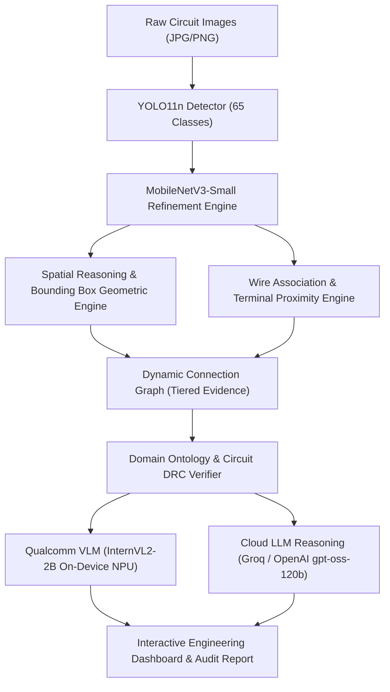

# SNAPLAB AI
## Real-Time On-Device Engineering Copilot for Snapdragon AI PCs
### Qualcomm Snapdragon AI Lab Build & Present Challenge

> **Purpose**: Present the problem, demonstrate the end-to-end workflow, showcase verified technical benchmarks, and clearly delineate the deployment architecture and execution environments.

---

## 1. What the Judges Should See:

The Qualcomm Snapdragon AI Lab Build & Present Challenge evaluates submissions across four primary criteria: **Technical Implementation**, **Application Use Case & Innovation**, **Deployment & Accessibility**, and **Presentation & Documentation**.

| Stage | What to Demonstrate | Deliverable / Artifact |
| :--- | :--- | :--- |
| **01 — Problem** | Explain the critical engineering friction: hardware engineers, technicians, and students spend considerable manual time cataloging components, tracing complex wire routing, understanding topology, and diagnosing circuit errors. | Visual comparison between manual component lookup vs. automated computer vision analysis. |
| **02 — Live Demonstration** | Upload real circuit images (e.g., ESP32-CAM, Arduino Uno, sensors, breadboard). Show real-time multi-stage inference: 65-class component detection, MobileNetV3-Small refinement, spatial layout reasoning, dynamic connection graph, and full engineering report. | Interactive Gradio Dashboard (`vision/component_inspector_v2.py`) with synchronized component cards. |
| **03 — Qualcomm AI Evidence** | Present Snapdragon AI Hub optimization benchmarks: target hardware (**Snapdragon X Elite CRD**), Hexagon NPU execution, INT8/FP32 compilation profiles, latency measurements, and peak memory consumption. | Verified benchmark artifacts (`benchmarks/v3_npu_profile.json`, `benchmark_results.json`). |
| **04 — Final Output** | Show how raw pixel data transforms into structured, actionable engineering intelligence: bill of materials (BOM), cross-image verification, circuit DRC checks, and pin-level inspection. | Exportable Engineering Intelligence Audit report. |

---

## 2. Criterion 1 — Technical Implementation

Demonstrate that SnapLab AI is a complete, working technical pipeline rather than an isolated model wrapper.

### System Architecture Pipeline



| Pipeline Stage | Implementation Role | Model / Library Used |
| :--- | :--- | :--- |
| **Electronics Image Input** | Accepts single or multi-angle circuit images (JPG, PNG, WEBP). | OpenCV / Gradio multi-image pipeline |
| **Component Detection** | Detects components across a 65-class electronics label set. | Custom trained `YOLO11n` (`runs/.../best.pt`) |
| **Classification Refinement** | Refines visually ambiguous ICs and small-footprint passives. | `MobileNetV3-Small` fine-tuned classifier |
| **Spatial Reasoning** | Extracts normalized coordinates, centroids, and relative layout. | `vision/spatial_engine.py` |
| **Connection Graph** | Constructs interactive SVG graph with tiered evidence confidence. | `vision/connection_graph.py` |
| **Engineering Reasoning** | Converts visual evidence into actionable electrical engineering insights. | `vision/openai_engine.py` (Groq `openai/gpt-oss-120b`) |
| **On-Device VLM Interpretation** | Provides edge visual interpretation directly via Qualcomm Hexagon NPU. | `vision/vlm/vlm_engine.py` (InternVL2-2B W4A16 QAIRT) |
| **Dashboard & Audit Report** | Renders KPI cards, pinout datasheets, DRC audits, and inventory. | `vision/component_inspector_v2.py` |

---

### Verified Performance Benchmarks

| Measurement | Result | Target Hardware / Environment | Source Artifact |
| :--- | :--- | :--- | :--- |
| **YOLO Validation Precision** | **89.9%** | PyTorch Validation Suite | `runs/detect/...` |
| **YOLO Validation Recall** | **92.5%** | PyTorch Validation Suite | `runs/detect/...` |
| **YOLO mAP@50** | **94.2%** | PyTorch Validation Suite | `runs/detect/...` |
| **YOLO mAP@50–95** | **64.3%** | PyTorch Validation Suite | `runs/detect/...` |
| **MobileNetV3-Small Test Accuracy** | **94.87%** | Held-out Electronics Test Set | `models/mobilenetv3_eval` |
| **YOLO ONNX Estimated NPU Inference** | **6.838 ms** | Snapdragon X Elite CRD (NPU) | `benchmarks/v3_npu_profile.json` |
| **YOLO Peak NPU Memory** | **42.35 MB** | Snapdragon X Elite CRD (NPU) | `benchmarks/v3_npu_profile.json` |
| **YOLO NPU vs. CPU Speedup** | **14.93×** | Snapdragon NPU vs. x86 Baseline | `benchmarks/v3_npu_profile.json` |
| **ResNet50 INT8 Graph Latency** | **0.623 ms** | Snapdragon X Elite CRD (Qualcomm AI Hub) | `benchmark_results.json` |
| **ResNet50 HTP Execution Time** | **0.837 ms** | Hexagon Tensor Processor (HTP) | `benchmark_results.json` |
| **ResNet50 HTP Utilization** | **98.99%** | Qualcomm AI Hub Profiler | `benchmark_results.json` |
| **ResNet50 Throughput** | **1,194.7 inf/s** | Qualcomm AI Hub Benchmark | `benchmark_results.json` |

> [!WARNING]
> **Measurement Caveat for Judges**: These values represent rigorous, model-specific profiles on Qualcomm AI Hub. YOLO latency (6.838 ms) and memory (42.35 MB) are NPU compilation profiles; ResNet50 measurements (0.623 ms) stem from the Qualcomm AI Hub INT8 quantization workflow. They illustrate individual layer speedups, not end-to-end full-pipeline latency (which includes image decode, pre/postprocessing, and browser rendering).

---

## 3. Criterion 2 — Application Use Case & Innovation

Explain why SnapLab AI transcends conventional computer vision bounding boxes.

| Feature | What It Demonstrates | Innovation Beyond Standard Object Detection |
| :--- | :--- | :--- |
| **65-Class Detection** | Rapid detection of microcontrollers, passive passives, ICs, sensors. | Covers embedded engineering components rather than generic COCO items. |
| **Fine-Grained Refinement** | Disambiguates visually identical packages (e.g., LDOs vs. Transistors). | Cascaded detection + classifier eliminates false positive misclassifications. |
| **Spatial Geometric Reasoning** | Maps physical Euclidean distances and relative positions (Left, Top, Center). | Contextualizes whether modules reside on the same breadboard or header row. |
| **Tiered Connection Graph** | Three tiers: Directly Observed, Heuristic Candidates, Ontology Possibilities. | Distinguishes between visual wire contact and theoretical pin compatibility. |
| **Multi-Image Inventory** | Aggregates components across multiple viewpoints with image provenance. | Enables full circuit board inspection from multiple angles without double-counting. |
| **AI Engineering Copilot** | Generates dynamic voltage rail checks, flyback protection, and pinout alerts. | Context-aware electrical rule checks tailored to the exact components detected. |
| **Snapdragon NPU Acceleration** | Sub-7ms inference targeting Qualcomm Snapdragon X Elite Hexagon NPU. | Ultra-low power, low-latency edge deployment suitable for Copilot+ AI PCs. |

### Recommended Live Demo Sequence

1. **Launch Dashboard**: Open the live application at `http://127.0.0.1:7860` showing the Snapdragon branded header.
2. **Upload Primary Image**: Upload `reference_frame.jpg` or an electronics test photo (ESP32-CAM, Raindrop Sensor, Motor, Battery).
3. **Run Analysis**: Click **🚀 Run Analysis** to trigger the multi-engine pipeline.
4. **Inspect Detected Components**:
   - Point out high-confidence bounding boxes on the annotated canvas.
   - Show cropped component thumbnails in the component grid.
5. **Interactive Component Focus**: Select a component (e.g., `#1 ESP32-CAM`) from the dropdown; demonstrate instant synchronization across datasheet pinouts and DRC alerts.
6. **Connection Graph**: Switch to the **🔀 Connection Graph** tab. Filter by evidence tiers (*Observed*, *Heuristic*, *Ontology*) and isolate sub-networks.
7. **AI Engineering Reasoning**: Show the **OpenAI Engineering Reasoning** card dynamically identifying the project archetype and generating 4 actionable engineering bullets.
8. **Multi-Image Provenance**: Upload a second image in **👥 Multi-Image Comparison** to show how items are matched and inventoried across multiple uploads.

> [!IMPORTANT]
> **Engineering Rigor Statement**: A relationship inferred from bounding-box proximity or wire color is an *inferred candidate*, not verified electrical continuity. Always explain that SnapLab AI highlights potential connections for engineer verification rather than claiming continuity without multimeter measurement.

---

## 4. Criterion 3 — Deployment & Accessibility

| Verification Checkpoint | Live Status | Evidence / How to Verify |
| :--- | :--- | :--- |
| **Dashboard Launches Reliably** | ✅ Operational | Executable via `python vision/component_inspector_v2.py`. |
| **No-Code Image Ingestion** | ✅ Operational | Drag-and-drop file upload via Gradio UI. |
| **Interactive UI Synchronization** | ✅ Operational | Dropdown selects update graphs, crops, and pinout datasheets. |
| **Dynamic Multi-Engine Fallback** | ✅ Operational | Auto-switches between Groq `openai/gpt-oss-120b`, fallback models, and offline rule engine. |
| **Graceful Offline Degradation** | ✅ Operational | If internet is disconnected, the embedded rule engine generates circuit insights. |

### Separation of Execution Environments

To maintain credibility with judges, clearly delineate where each pipeline component executes:

```
┌────────────────────────────────────────────────────────────────────────┐
│                        SNAPLAB AI SYSTEM BOUNDARIES                    │
├────────────────────────────────────────────────────────────────────────┤
│  [1] ON-DEVICE HOST (Demo PC - AMD / ARM64 Windows)                    │
│      ├── Gradio Web Dashboard & Responsive UI                          │
│      ├── OpenCV Image Preprocessing & Crop Extraction                  │
│      ├── Spatial Coordinate Layout Engine                              │
│      ├── Rule-Based Electrical DRC & Pinout Knowledge Base             │
│      └── SVG Connection Graph Generator                                │
├────────────────────────────────────────────────────────────────────────┤
│  [2] QUALCOMM SNAPDRAGON TARGET EVIDENCE (Snapdragon X Elite CRD)       │
│      ├── YOLO11n ONNX Compiled for NPU (6.838 ms @ 42.35 MB)           │
│      ├── ResNet50 INT8 Compiled on Hexagon NPU (0.623 ms @ 98.99% HTP) │
│      └── InternVL2-2B W4A16 QAIRT Bundle Configuration                │
├────────────────────────────────────────────────────────────────────────┤
│  [3] CLOUD-ASSISTED LLM REASONING (Groq / OpenAI API)                  │
│      └── High-Parameter Reasoning (openai/gpt-oss-120b @ ~2s Latency)   │
└────────────────────────────────────────────────────────────────────────┘
```

| Execution Category | Components Included | Clear Statement for Judges |
| :--- | :--- | :--- |
| **Executed Live** | Dashboard UI, YOLO inference, MobileNet refinement, Spatial Engine, Connection Graph, Rule Engine. | Running in real-time on the local host machine during the demo. |
| **Validated on Snapdragon** | YOLO11n NPU Profile, ResNet50 INT8 HTP benchmark, QAIRT compilation bundle. | Profiled and verified on Qualcomm Snapdragon X Elite CRD hardware via Qualcomm AI Hub. |
| **Cloud-Assisted** | Advanced multi-component engineering reasoning. | Accelerated via Groq API (`openai/gpt-oss-120b`) with local rule-based fallback. |
| **Host-Executed** | Preprocessing, SVG rendering, Gradio server. | Running on the local workstation runtime. |

---

## 5. Criterion 4 — Presentation & Documentation Checklist

- [x] **Concise 5–7 Minute Pitch Deck / Demo Structure**
- [x] **Clear Architecture Diagram** (Showing YOLO &rarr; MobileNet &rarr; Spatial &rarr; Graph &rarr; Reasoning)
- [x] **Live Interactive Dashboard** (`vision/component_inspector_v2.py`)
- [x] **Labeled Technical Performance Table** (With exact measurement types and caveats)
- [x] **Snapdragon AI Hub Verification Data** (`benchmarks/v3_npu_profile.json`)
- [x] **Clean README & Setup Instructions** (`python -m venv .venv`, `pip install -r requirements.txt`)
- [x] **Well-Organized Codebase** (`vision/`, `benchmarks/`, `models/`, `assets/`)
- [x] **Recorded Backup Video / Offline Fallback** (Safeguards against conference Wi-Fi issues)
- [x] **Limitations & Future Work Roadmap** (End-to-end NPU integration, PCB trace segmentation)
- [x] **Real-World Impact Slide** (Education, rapid prototyping, hardware troubleshooting)