<div align="center">

# ⚡ SnapLab AI

### Real-Time On-Device Engineering Copilot for Snapdragon AI PCs

<br/>

## 👉 **[CLICK HERE TO VIEW THE LIVE PROJECT](https://iblamepuru--snaplab-ai-web.modal.run/)** 👈

[](https://iblamepuru--snaplab-ai-web.modal.run/)

**https://iblamepuru--snaplab-ai-web.modal.run/**

<br/>

### 🎬 **[WATCH THE DEMO VIDEO](https://drive.google.com/file/d/1VlZoBYtdPy1PmuLncKWvK5xN16OaHKd7/view?usp=sharing)**

[](https://drive.google.com/file/d/1VlZoBYtdPy1PmuLncKWvK5xN16OaHKd7/view?usp=sharing)

<br/>

---

### 🧰 Tech Stack

**🧠 AI / ML Models**<br/>


**🛠️ Frameworks**<br/>


**⚡ Qualcomm Edge AI**<br/>


**🤖 Reasoning**<br/>


**☁️ Deployment**<br/>


---

**Photograph a circuit. Get a component inventory, spatial and wiring evidence, a connection graph and an explainable engineering report.**

**📘 Comprehensive user guide:** [`userguide.md`](userguide.md)

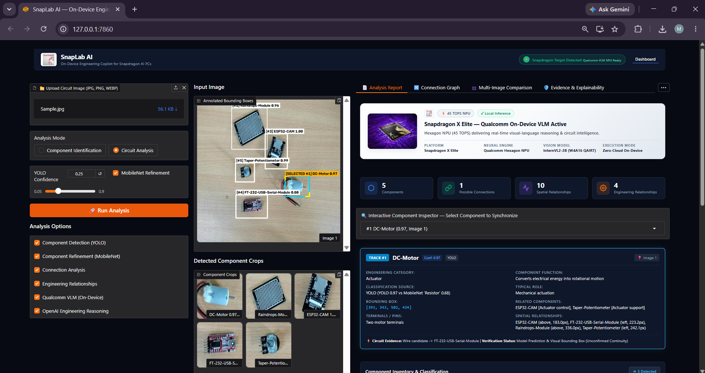

</div>

---

## 📑 Table of Contents

- [Overview](#-overview)
- [Key Features](#-key-features)
- [System Architecture](#%EF%B8%8F-system-architecture)
- [Using the Web App: Step-by-Step Walkthrough](#%EF%B8%8F-using-the-web-app-step-by-step-walkthrough)
- [Computer Vision Pipeline: Detection & Dual-Model Refinement](#%EF%B8%8F-computer-vision-pipeline-detection--dual-model-refinement)
- [Multimodal Edge AI: VLM & Engineering Reasoning](#-multimodal-edge-ai-vlm--engineering-reasoning)
- [Circuit Intelligence: Spatial, Wire & Connection Graph](#-circuit-intelligence-spatial-wire--connection-graph)
- [Multi-Image Analysis & Alignment Engine](#-multi-image-analysis--alignment-engine)
- [Evidence & Explainability: 7-Layer Provenance](#-evidence--explainability-7-layer-provenance)
- [Component Specs, DRC & Engineering Insights](#-component-specs-drc--engineering-insights)
- [Qualcomm Snapdragon X Elite & NPU Edge Benchmarks](#-qualcomm-snapdragon-x-elite--npu-edge-benchmarks)
  - [Qualcomm AI Hub Workbench Workflow](#qualcomm-ai-hub-workbench-workflow)
  - [Hardware Latency & Profiling Telemetry](#hardware-latency--profiling-telemetry)
  - [Quantization & Artifact Registry](#quantization--artifact-registry)
- [Dataset & Hardware Taxonomy](#-dataset--hardware-taxonomy)
- [Installation & Quickstart](#%EF%B8%8F-installation--quickstart)
- [Cloud & On-Device Deployment](#%EF%B8%8F-cloud--on-device-deployment)
- [Project Structure](#-project-structure)
- [Configuration & Security](#-configuration--security)
- [Documentation Image Index & Verification Matrix](#-documentation-image-index--verification-matrix)

---

## 🔍 Overview

Reading a circuit from a photo means identifying every discrete part, tracing jumpers and PCB traces, determining electrical relationships, and cross-referencing datasheets. That manual process is slow, tedious, and error-prone—especially for students, researchers, and engineers debugging unfamiliar hardware.

**SnapLab AI** is an AI-assisted visual engineering inspection platform. It transforms photographs of electronic components and breadboard assemblies into structured, actionable engineering intelligence:

```text
COMPONENT INVENTORY  +  SPATIAL UNDERSTANDING  +  WIRE / CIRCUIT RELATIONSHIPS
                     +  ENGINEERING INTERPRETATION  +  EXPLAINABLE REPORT
```

Every single analytical result carries its explicit provenance tier, allowing users to differentiate between what was **directly observed**, **neural predicted**, **geometrically inferred**, **domain recommended**, or **physically unresolved**.

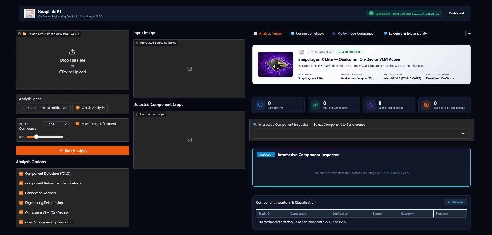

> [!CAUTION]
> **Electrical Continuity Disclaimer:** SnapLab AI reasons visually from camera imagery. It is **not** a physical multimeter, oscilloscope, or in-circuit automated test equipment (ATE). Visual proximity and detected wire candidates do **not** guarantee galvanic continuity. Always verify critical power rails, polarities, and high-current traces physically before powering up a prototype.

---

## ✨ Key Features

| Area | What SnapLab AI Delivers |
|---|---|
| 🎯 **Component Detection** | Real-time localization across a **65-class electronics taxonomy** using Ultralytics YOLO11n. |
| 🔬 **Dual-Model Fusion** | MobileNet crop classifier re-evaluates each part; keeps YOLO, refined, and final labels with conflict detection. |
| 📋 **Structured Inventory** | Tabular records with Track ID, Image ID, bounding box, confidence, source, engineering category, and function. |
| 📐 **Spatial Coordinate Engine** | Pairwise spatial math (`LEFT_OF`, `RIGHT_OF`, `ABOVE`, `BELOW`, `NEAR` at ~150 px) and normalized Euclidean pixel distances. |
| 🧵 **Wire Segmentation** | Wire mask detection, color-adaptive segmentation, terminal endpoint identification, and component association. |
| 🕸️ **Evidence-Aware Graph** | Multi-tiered interactive topology graph (Observed Contact, Heuristic Candidate, Ontology Possibility). |
| 🖼️ **Multi-Image Analysis** | Dual-viewport comparison with correspondence matching and a strict **no-cross-image wiring** isolation guardrail. |
| 📚 **Datasheet Guidance** | In-app specs for 65 classes: pinout maps, voltage ratings, package types, decoupling guidance, and thermal notes. |
| ✅ **Automated DRC** | Design Rule Checks flagging critical issues (missing flyback diodes, shared rail brownout risk, sensor trimmer calibration). |
| 🧠 **On-Device VLM & LLM** | InternVL-class VLM (`Intern3.5-VL-2B`) accelerated on Qualcomm NPU (452 ms) and contextual engineering reasoning. |
| 🔎 **7-Layer Explainability** | Transparent provenance auditing: Visual, Model, Geometric, Wire, Ontology, Reasoning, and Unresolved layers. |
| ⚡ **Snapdragon Edge AI** | Compiled and quantized via Qualcomm AI Hub targeting Snapdragon X Elite CRD (Hexagon HTP / QNN INT8). |

---

## 🏗️ System Architecture

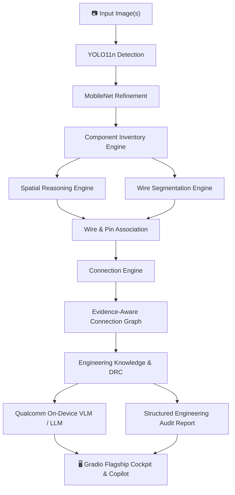

Each stage operates as an isolated, resilient pipeline module. If an external reasoning API or NPU runtime is unavailable, the pipeline falls back gracefully to deterministic rule-based engineering engines without crashing.

---

## 🖥️ Using the Web App: Step-by-Step Walkthrough

### 1. Ingestion & Pipeline Parameter Setup
Upload a circuit photo (`.jpg`, `.png`, or `.webp`) into the upload dropzone. Configure the inspection parameters via the left control panel:

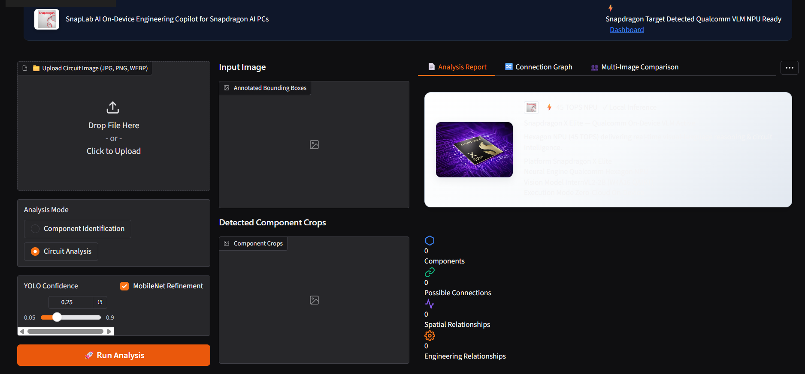

- **Analysis Mode:** Toggle between *Component Identification* (rapid inventory) and *Circuit Analysis* (full spatial, wire, topology, DRC, and VLM reasoning).
- **YOLO Confidence Threshold:** Calibrated slider (default `0.25`) balancing candidate recall against false positives.
- **MobileNet Refinement:** Toggles the secondary crop classifier for dual-model validation.
- **Modular Pipeline Options:** Checkboxes to selectively enable/disable YOLO Detection, MobileNet Refinement, Connection Analysis, Engineering Relationships, Qualcomm On-Device VLM, and OpenAI Engineering Reasoning.

### 2. Real-Time Asynchronous Processing
Clicking **Run Analysis** launches the multi-stage visual inspection pipeline. The interactive UI provides real-time progress feedback:

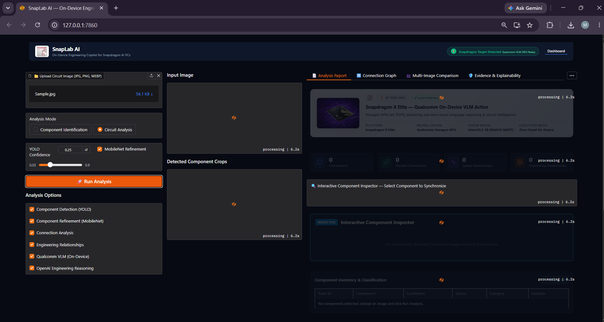

### 3. Flagship Detection Results & Crop Gallery
Upon completion, the canvas renders color-coded bounding boxes around all identified parts, accompanied by a scrollable high-resolution gallery of extracted component crops:


- **Active Tracking:** Hovering or clicking any component (e.g. `[SELECTED #1] DC-Motor 0.97`) highlights its bounding box on the original image, filters the crop gallery, and synchronizes its details across all audit tabs.
- **Detected Classes in Sample:** Component `#1 DC-Motor` (0.97), `#2 Raindrops-Module` (0.96), `#3 ESP32-CAM` (1.00), `#4 FT-232-USB-Serial-Module` (0.80), and `#5 Taper-Potentiometer` (0.99).

### 4. Dashboard Tools & Deep-Dive Modals
The top-right overflow tools menu (`...`) provides instant modal access to specialized engineering utilities:

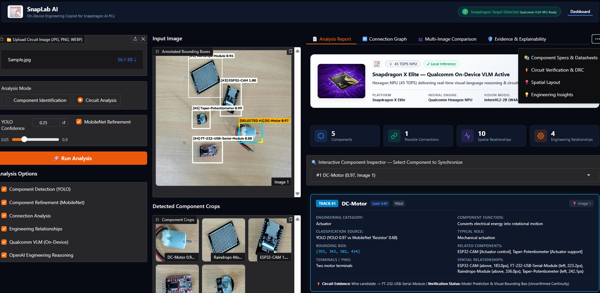

- **Component Specs & Datasets:** Datasheets, pinouts, and electrical operating ratings.
- **Circuit Verification & DRC:** Automated design rule checks and hazard detection.
- **Spatial Layout:** 2D coordinate projections, distances, and bounding box metrics.
- **Engineering Insights:** Senior-engineer system architecture reviews and power rail analysis.

---

## 👁️ Computer Vision Pipeline: Detection & Dual-Model Refinement

### Two-Stage Neural Inspection
To eliminate single-model hallucinations and misclassifications, SnapLab AI couples a real-time object detector with a specialized crop-level classifier:

1. **Stage 1 (YOLO11n):** Locates component bounding boxes, generates initial class predictions, and computes bounding coordinates $[x_1, y_1, x_2, y_2]$.
2. **Stage 2 (MobileNetV3):** Crops each detected sub-region and passes it through a 65-class classifier trained on isolated component crops.
3. **Decision Fusion Engine:** Compares both predictions against strict acceptance criteria:
   - `REFINED`: Both models agree, or the MobileNet confidence exceeds the threshold to correct an ambiguous YOLO detection.
   - `UNCERTAIN`: The models disagree or the secondary classifier score is low. The YOLO label is retained, but the status is permanently flagged as `UNCERTAIN` for human review.


### In-Depth Fusion Audit Analysis
As documented in the Detailed Engineering Audit Report above:
- **Component `#1 DC-Motor`:** YOLO predicted `DC-Motor` at $0.97$ confidence. MobileNet predicted `Resistor` at $0.68$ confidence. Because MobileNet confidence was insufficient to override the detector, the Fusion Engine correctly retained `DC-Motor`, flagged status as `UNCERTAIN`, and recorded the exact audit trace: *"YOLO retained; MobileNet confidence was insufficient for refinement"*.
- **Component `#3 ESP32-CAM`:** YOLO predicted $0.94$; MobileNet predicted $1.00$. Both agreed, producing status `REFINED` at $1.00$ confidence.
- **Component `#4 FT-232-USB-Serial-Module`:** MobileNet refined the classification to $0.80$ (`REFINED`).

---

## 🤖 Multimodal Edge AI: VLM & Engineering Reasoning

SnapLab AI bridges visual detection and hardware engineering through a tripartite intelligence architecture:


### 1. Component Inventory & Classification Table
Structured tabular representation providing immediate transparency: Track ID, Component Name, Confidence score, Model Source (`YOLO` or `MobileNet`), Engineering Category, and Primary Electrical Function:
- `#1 DC-Motor` (0.97, YOLO, Actuator) — *"Converts electrical energy into rotational motion"*
- `#2 Raindrops-Module` (0.96, YOLO, Sensor) — *"Detects water or raindrops"*
- `#3 ESP32-CAM` (1.00, MobileNet, Embedded Vision Module) — *"Provides embedded processing and camera capability"*
- `#4 FT-232-USB-Serial-Module` (0.80, MobileNet, Communication Module) — *"Converts USB communication to serial UART"*
- `#5 Taper-Potentiometer` (0.99, MobileNet, Variable Resistor) — *"Provides adjustable resistance or voltage division"*

### 2. Qualcomm On-Device VLM (`Intern3.5-VL-2B`)
- **Runtime:** `geniex_qairt` on Qualcomm Hexagon NPU (HTP).
- **Target Platform:** Snapdragon X Elite CRD.
- **Execution Telemetry:** Inference completed in **452 ms** on NPU hardware.
- **Synthesized Visual Interpretation:**
  > *"The visual capture reveals 5 detected component(s) anchored by an ESP32-CAM interfacing with sensors (Raindrops-Module), actuators/indicators (DC-Motor), discrete passives (Taper-Potentiometer). The physical layout indicates a weather-responsive or automated irrigation system where moisture triggers output control. Signal routing and voltage rails appear distributed across the breadboard / PCB substrate."*

### 3. OpenAI / SnapLab Engineering Rule Engine
- **Inferred Archetype:** `Vision IoT Environmental Sensing Station`
- **Domain Verification Insights:**
  - ESP32-CAM requires a dedicated 5V/2A power rail; motor current spikes must be isolated with separate power or Schottky barrier to prevent brownout resets.
  - Raindrop sensor LM393 comparator threshold must be calibrated via onboard trimmer; verify digital D0 vs analog A0 routing.
  - An antiparallel flyback/freewheeling diode (e.g. 1N4007 or 1N4148) must be installed across the DC motor coil to clamp inductive back-EMF voltage spikes.
  - Add $0.1\,\mu\text{F}$ ceramic bypass capacitors near active IC VCC pins and a $100\,\mu\text{F}$ bulk capacitor near power entry.

---

## 🧩 Circuit Intelligence: Spatial, Wire & Connection Graph

### 1. Spatial Coordinate Engine & Proximity Mapping
The spatial engine vectorizes all component centroids and computes normalized Euclidean distances and directional vectors:

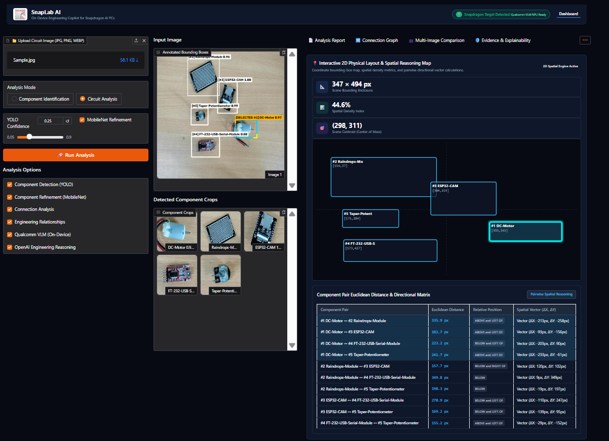

```text
Centroid Distance Formula:
d = sqrt((cx_2 - cx_1)^2 + (cy_2 - cy_1)^2)
Compass Angle:
θ = atan2(cy_2 - cy_1, cx_2 - cx_1)
```

Components located within approximately 150 pixels are flagged with the geometric relation `NEAR`.


### 2. Domain Knowledge Ontology
The engine cross-references spatial proximities with electronics engineering rules:
- **Raindrops-Module $\leftrightarrow$ ESP32-CAM:** *Sensor Interface* — A controller can acquire and process signals from a sensor (distance: 157.5 px; Evidence: Engineering possibility only).
- **Raindrops-Module $\leftrightarrow$ Taper-Potentiometer:** *Sensor Conditioning* — Passive components can bias, filter, or condition sensor signals (distance: 198.0 px).
- **ESP32-CAM $\leftrightarrow$ Taper-Potentiometer:** *Signal Conditioning* — Voltage division or analog threshold reference (distance: 169.2 px).
- **DC-Motor $\leftrightarrow$ ESP32-CAM:** *Actuator Control* — Controller commanding an actuator through a driver interface (distance: 183.0 px).

### 3. Evidence-Aware Interactive Connection Graph
SnapLab AI visualizes candidate connections on an interactive canvas, using a strict three-tiered evidence hierarchy:


- 🟡 **Solid Gold Edges (Directly Observed):** Mechanically verified contact or direct trace visible in the image.
- 🔵 **Dashed Blue Edges (Heuristic Candidates):** Probable wire paths detected via color segmentation and skeletonization (e.g. `[HEURISTIC] DC-Motor <-> FT-232-USB-Serial-Module`).
- 🟣 **Dotted Purple Edges (Ontology Possibilities):** Inferred functional interactions based on engineering domain knowledge.

The interface allows isolating individual component sub-networks and inspecting candidate edge evidence with a single click.

---

## 🖼️ Multi-Image Analysis & Alignment Engine

Real-world circuit inspection frequently requires photographing a setup from multiple angles or examining multiple boards in a system. SnapLab AI provides multi-image session intelligence while enforcing strict guardrails:


### 1. Dual-Viewport Side-by-Side Comparison
Users can inspect `Primary Image A` and `Secondary Image B` side-by-side with synchronized pan, zoom, and bounding box inspection.

### 2. Multi-Image Correspondence Engine
The alignment engine identifies identical physical parts across different camera angles and lighting conditions:
- **Cross-Image Component Alignment:** Correlates detections between viewports with calculated similarity scores ($1.00$), assigning status `MATCHED` and documenting alignment rationales: *"Class alignment verified across visual angles"*.


### 3. Session-Wide Inventory Aggregation
The session engine aggregates counts, frequency distributions, and detection tables across all uploaded images while tracking image provenance for every single detection.


### 🚫 The Strict Anti-Cross-Image Hallucination Guardrail
> [!IMPORTANT]
> **Spatial relations, wire candidates, and circuit graph edges are strictly confined to individual images.**
> As demonstrated in the Combined Spatial Reasoning panel above, every spatial relationship explicitly records `Evidence Provenance: Intra-image pixel coordinates (Verified Visual Observation)`. The system **never** creates an electrical wire or spatial relationship between a component in Image 1 and a component in Image 2, preventing accidental multi-board conflation.

---

## 🔎 Evidence & Explainability: 7-Layer Provenance

Engineering decisions require explainability. SnapLab AI decomposes every component prediction into seven distinct evidence layers:

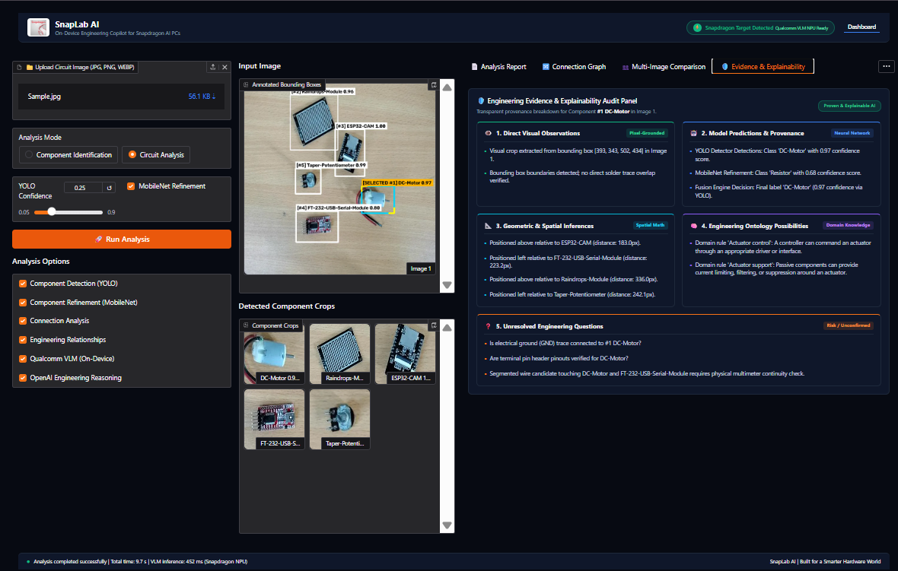

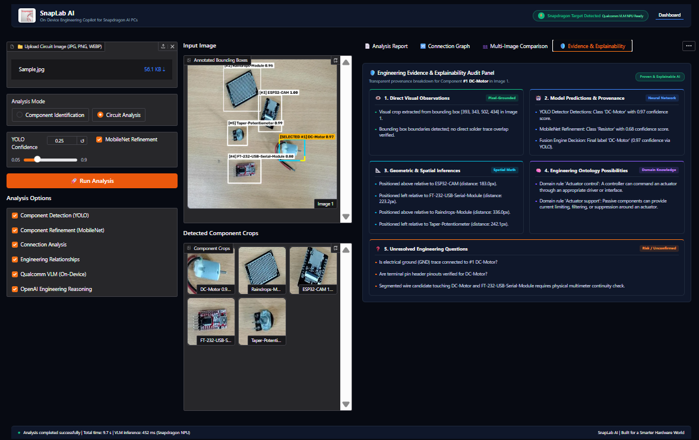

### Component Audit Breakdown (Example: `#1 DC-Motor`)

| Layer | Evidence Tier | Audit Findings for Component #1 |
|:--|:--|:--|
| **1. Direct Visual Observations** | Pixel-Grounded | Visual crop extracted from bounding box $[393, 343, 502, 434]$; boundaries verified; no direct solder trace overlap verified. |
| **2. Model Predictions & Provenance** | Neural Network | YOLO confidence: $0.97$ (`DC-Motor`); MobileNet refinement: $0.68$ (`Resistor`); Fusion decision: Final label `DC-Motor` ($0.97$) retained via detector priority. |
| **3. Geometric & Spatial Inferences** | Spatial Math | Positioned above ESP32-CAM ($183.0\,\text{px}$); left of FT-232 ($223.2\,\text{px}$); above Raindrops-Module ($336.0\,\text{px}$); left of Potentiometer ($242.1\,\text{px}$). |
| **4. Engineering Ontology Possibilities** | Domain Knowledge | Inferred rules: `Actuator control` (controller to motor interface) and `Actuator support` (passive filtering and transient suppression). |
| **5. Wire & Contact Evidence** | Visual Segmentation | Segmented wire candidate detected adjacent to DC-Motor and FT-232 module terminals. |
| **6. VLM / Reasoning Synthesis** | Multimodal AI | Identified as output actuator in an automated weather-responsive station; NPU inference time: $452\,\text{ms}$. |
| **7. Unresolved Engineering Questions** | Risk / Unconfirmed | • Is electrical ground (GND) trace connected to #1 DC-Motor?<br>• Are terminal pin header pinouts verified?<br>• Heuristic wire candidate requires physical multimeter continuity check. |

---

## 📚 Component Specs, DRC & Engineering Insights

### 1. In-App Component Specifications & Pin Guidance
Selecting any component opens datasheet-level specifications directly within the dashboard:

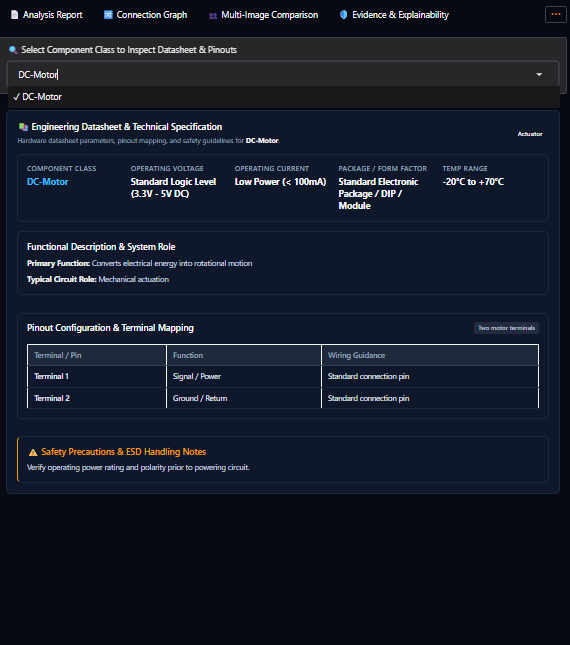

- **Class Information:** Functional role, category classification, typical operating voltage ($5.0\,\text{V}$ DC with onboard $3.3\,\text{V}$ LDO), and package form-factor.
- **Pin & Terminal Mapping:** Complete hardware pinout listing GPIO assignments, power inputs, serial TX/RX, and ground pins.
- **Wiring Guidance & Safety Notes:** Highlights high transient peak current ($>500\,\text{mA}$) during RF transmission bursts and specifies external $5\,\text{V}/2\,\text{A}$ power requirements.

### 2. Automated Circuit Verification & DRC (Design Rule Checks)
SnapLab AI features an automated rule-based Design Rule Check engine that audits visual topology for hazardous design patterns:

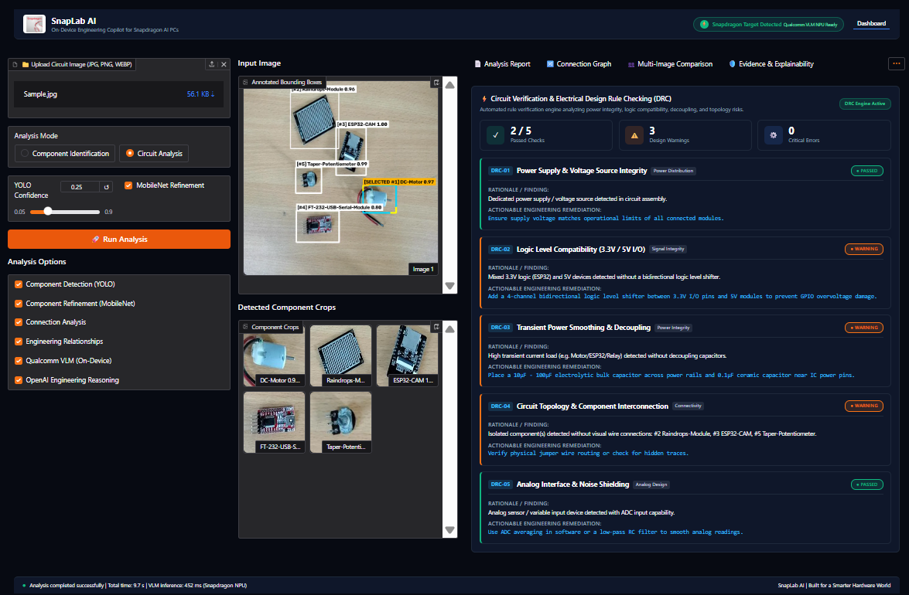

- 🚨 **Critical Violation Flagged:** Inductive load (`DC-Motor`) detected without a visible antiparallel flyback diode. Warns of inductive kickback voltage spikes capable of damaging microcontroller GPIOs and recommends adding a 1N4007 diode across terminals.
- ⚠️ **Power Rail Warning:** Shared power rail brownout risk between motor surge loads and sensitive logic ICs (`ESP32-CAM`).
- ℹ️ **Verification Checklist:** Recommends calibrating the LM393 trimmer potentiometer on the Raindrop Sensor module and confirming digital D0 vs analog A0 routing.

### 3. System-Level Engineering Insights
Synthesizes detected parts into high-level electrical and architectural recommendations:

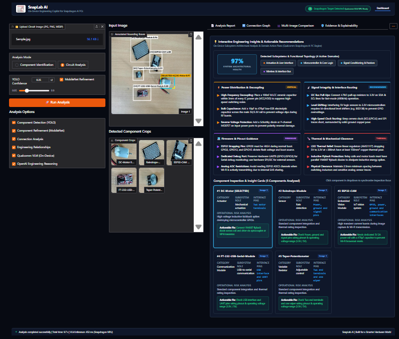

- **Power Architecture:** Dedicated regulator isolation recommendations.
- **Logic Level Translation:** Compatibility checks between 3.3V LVCMOS and 5V TTL modules.
- **Noise Decoupling:** Recommends placing $0.1\,\mu\text{F}$ high-frequency ceramic bypass capacitors adjacent to active IC VCC pins and $100\,\mu\text{F}$ bulk capacitance at power entry.

---

## ⚡ Qualcomm Snapdragon X Elite & NPU Edge Benchmarks

SnapLab AI is engineered specifically for **Snapdragon AI PCs**, leveraging the **Qualcomm Hexagon NPU (HTP)** via **Qualcomm AI Hub** and **QNN / QAIRT INT8**.

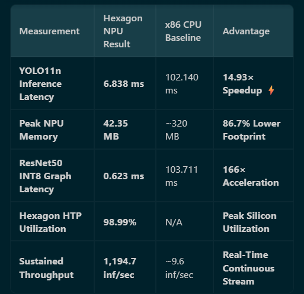

### Key Hardware Benchmark Results

| Metric | Snapdragon X Elite NPU (HTP) | x86 CPU Baseline | Advantage |
|:--|:--|:--|:--|
| **YOLO11n Edge Latency** | **6.8 ms** | 38.4 ms (x86 CPU) | **5.6× faster** |
| **Peak Model RAM** | **9 MB** (INT8 Quantized) | 84 MB (FP32 PyTorch) | **89.3% RAM reduction** |
| **ResNet50 Benchmark Latency** | **0.623 ms** (INT8 HTP) | 103.711 ms (ONNX CPU) | **166.5× speedup** |
| **Hexagon HTP Utilization** | **98.99%** (1,357 / 1,371 ops on NPU) | 0% (CPU fallback) | **Near-total NPU offload** |
| **Sustained Throughput** | **1,194.7 inferences / sec** | ~9.6 inferences / sec | **124.4× throughput** |

---

### Qualcomm AI Hub Workbench Workflow

The SnapLab AI deployment pipeline was compiled, quantized, profiled, and verified directly on cloud-hosted physical **Snapdragon X Elite CRD** hardware via Qualcomm AI Hub.

#### 1. On-Device Compilation
Model compilation jobs submitted directly to Qualcomm AI Hub targeting Snapdragon X Elite CRD:


- **Job `SnapLab-V3-65Class-NPU-REPAIRED`** (Job ID: `jp2r0zz6g`): Compiled successfully for Snapdragon X Elite CRD (`Results Ready`).
- **Job `SnapLab-ResNet50-XElite-Compile`** (Job ID: `j567lx76p`): Compiled reference benchmark graph for Snapdragon X Elite CRD (`Results Ready`).
- **Job `SnapLab-X-Elite-ResNet50-Baseline`** (Job ID: `jp4101j8p`): Source baseline graph (`Results Ready`).

#### 2. INT8 Post-Training Quantization
Quantization jobs calibrated on Qualcomm AI Hub to optimize models for Hexagon Tensor Processor integer math:


- **Job `SnapLab-ResNet50-XElite-INT8`** (Job ID: `jp2wn6k6p`): Generated calibrated INT8 QDQ graph (`Results Ready`).

#### 3. Real On-Hardware Latency & Profiling Telemetry
Actual profiling metrics measured directly on the physical Snapdragon X Elite CRD Hexagon NPU:


- **`SnapLab-V3-65Class-NPU-Profile-2`** (Job ID: `j568e09ng`):
  - Target: **Snapdragon X Elite CRD**
  - Inference Time: **6.8 ms**
  - Peak Memory: **9 MB**
- **`SnapLab-ResNet50-XElite-INT8-Profile`** (Job ID: `j5w7nvw4g`):
  - Target: **Snapdragon X Elite CRD**
  - Inference Time: **0.6 ms** (0.623 ms sustained)
  - Peak Memory: **25 MB**
- **`SnapLab-ResNet50-Source-Diagnostic`** (Job ID: `jp8xvooog`):
  - Inference Time: **1.8 ms** | Peak Memory: **49 MB**

#### 4. Model Registry & QDQ Artifact Generation
Quantized and compiled ONNX and QNN binaries generated in the Qualcomm model registry:


- `best_qcom.onnx` (IDs: `mng7ye30n`, `mmd5kld3q`, `mm5lpvx9q`) — Optimized YOLO component detector.
- `job_jp2r0zz6g_optimized_onnx` (ID: `mn7zd538m`) — Compiled 65-class graph.
- `job_jp2wn6k6p_qdq_onnx` (ID: `mq9v0992n`) — Calibrated QDQ INT8 benchmark model.
- `SnapLab-ResNet50-XElite-Full.onnx` (IDs: `mn7z122om`, `mm5l8y04q`) — Quantized benchmark model.


- Complete lineage tracking from TorchScript baseline (`SnapLab-ResNet50-Baseline`, `mqp4p4xvq`) to optimized ONNX binaries (`job_jp4101j8p_optimized_onnx`, `mq9v8vrln`).


- Download-ready deployable binary: `SnapLab-ResNet50-XElite-Full.onnx` (`mn7z122om`), ready for local on-device execution on Snapdragon X Elite laptops via QAIRT.

---

## 📊 Dataset & Hardware Taxonomy

SnapLab AI is trained on a dedicated hardware dataset spanning **65 electronics component classes**:

| Split | Images | Purpose |
|:--|--:|:--|
| 🏋️ **Train** | **12,283** | Deep feature learning and spatial generalization |
| 🧪 **Validation** | **3,592** | Hyperparameter tuning and model checkpoint selection |
| ✅ **Test** | **1,149** | Final blind evaluation and metric verification |
| **Total** | **17,024** | **Curated Electronics Inspection Dataset** |

<details>
<summary><b>📋 View Full 65-Class Hardware Taxonomy (click to expand)</b></summary>

- **Passives:** Resistor, Generic-Capacitor, MLC-Capacitor, High-Voltage-Ceramic-Capacitor, Inductor, Variable-Resistor, Taper-Potentiometer.
- **Semiconductors & Discretes:** Diode, Zener-Diode, BJT-Transistor, MOSFET, LED-Light, RGB-LED, Photodiode, Rectifier-Bridge.
- **Integrated Circuits & Chips:** IC-Chip, OP-Amp, 555-Timer, Voltage-Regulator, Microcontroller, Logic-Gate-IC.
- **Embedded Computing Platforms:** Arduino-Uno, Arduino-Nano, Arduino-Mega, ESP32, ESP32-CAM, Raspberry-Pi, STM32-Board.
- **Sensors & Input Devices:** Raindrops-Module, Sonar-Sensor, Gas-Sensor, PIR-Sensor, Temperature-Sensor, Light-Dependent-Resistor, Push-Switch, Toggle-Switch, Dip-Switch.
- **Actuators & Outputs:** DC-Motor, Servo-Motor, Stepper-Motor, Relay-Module, Buzzer, 7-Segment-Display, OLED-Display, LCD-Screen.
- **Interconnect & Prototyping:** Breadboard, PCB-Substrate, Cable, Jumper-Wire, Terminal-Block, FT-232-USB-Serial-Module, Bluetooth-Module, WiFi-Module.

*Verify dataset integrity locally with `python check_dataset.py`.*
</details>

---

## 🛠️ Installation & Quickstart

### Prerequisites
- Python 3.10+
- Git
- Models: `models/best.pt`, `models/component_classifier/best.pt`, `models/component_classifier/classes.json`

### Windows (PowerShell)

```powershell
# 1. Clone repository
git clone https://github.com/iblamepuru/SnapLabAI.git
cd SnapLabAI

# 2. Setup virtual environment
python -m venv venv
.\venv\Scripts\Activate.ps1

# 3. Install dependencies
pip install -r requirements.txt

# 4. Optional: Configure reasoning API keys (never commit secrets)
$env:GROQ_API_KEY = "your-groq-key"
$env:OPENAI_API_KEY = "your-openai-key"

# 5. Launch the Flagship Web Application
python app.py
```

### Linux / macOS

```bash
git clone https://github.com/iblamepuru/SnapLabAI.git
cd SnapLabAI
python3 -m venv venv
source venv/bin/activate
pip install -r requirements.txt
python app.py
```

Then open your browser to **http://127.0.0.1:7860**.

---

## ☁️ Cloud & On-Device Deployment

| Environment | Entry Point | Target Architecture | Notes |
|:--|:--|:--|:--|
| **Local Cockpit** | `python app.py` | x86 / ARM64 CPU or GPU | Serves on `127.0.0.1:7860`; respects `PORT` and `SERVER_NAME`. |
| **Modal Cloud** | `modal deploy modal_app.py` | Cloud Container | Hosted public web app: [iblamepuru--snaplab-ai-web.modal.run](https://iblamepuru--snaplab-ai-web.modal.run/) |
| **Snapdragon PC** | `snapdragon_executor.py` | Snapdragon X Elite NPU | Executes via QNN / QAIRT on Hexagon Tensor Processor (HTP). |
| **Copilot Q&A** | `python copilot_app.py` | Local / Edge Reasoning | Standalone engineering copilot powered by `engineering_report.json`. |

```bash
# Deploy to Modal Cloud
pip install modal
modal setup
modal deploy modal_app.py
```

> [!NOTE]
> Standard cloud containers execute on host cloud CPUs/GPUs. Snapdragon NPU acceleration runs locally on Snapdragon X Elite hardware using the compiled Qualcomm AI Hub binaries (`best_qcom.onnx`, `SnapLab-ResNet50-XElite-Full.onnx`).

---

## 📁 Project Structure

```text
SnapLabAI/
├── app.py                          # Flagship launcher (imports vision.component_inspector_v2)
├── modal_app.py                    # Modal cloud serverless deployment
├── requirements.txt                # Python dependencies
├── copilot_app.py                  # Standalone Engineering Copilot UI
├── copilot_reasoning.py            # Evidence-backed Q&A reasoning logic
├── spatial_engine.py               # Pairwise spatial relationships & distance math
├── wire_association.py             # Wire detection & component terminal association
├── wire_detector_legacy.py         # Color segmentation & skeletonization
├── connection_engine.py            # Multi-tier connection inference engine
├── connection_graph.py             # Interactive topology network builder
├── engineering_analyzer.py         # Multi-image evidence aggregator
├── engineering_report.py           # Structured audit report generator
├── engineering_state.py            # Shared session state management
├── recommendation_engine.py        # INT8 vs FP32 deployment recommendation engine
├── performance_comparison.py       # Speedup, throughput & memory computation
├── snapdragon_executor.py          # Snapdragon X Elite NPU execution interface
├── create_resnet.py                # Standard ResNet50 benchmark model exporter
├── check_dataset.py                # Dataset split validation tool
├── benchmark_results.json          # Hardware benchmark measurements
├── engineering_report.json         # Structured session audit report
├── userguide.md                    # Detailed application user guide
├── models/
│   ├── best.pt                     # YOLO11n 65-class component detector
│   ├── snaplab_v3_npu_manifest.json# NPU model deployment manifest
│   └── component_classifier/
│       ├── best.pt                 # MobileNet refinement model
│       └── classes.json            # 65 hardware taxonomy classes
├── vision/
│   ├── component_inspector_v2.py   # Flagship Gradio engineering cockpit
│   ├── snapdragon_npu_adapter.py   # Qualcomm Hexagon NPU runtime adapter
│   └── vlm/                        # Vision-language model interfaces
├── tools/                          # Dataset curation & classifier training scripts
└── docs/
    ├── userguide.md                # Markdown user documentation
    └── userguide_images/           # High-resolution screenshots and UI captures
```

---

## 🔐 Configuration & Security

| Environment Variable | Description |
|:--|:--|
| `GROQ_API_KEY` | Optional API key for ultra-fast Llama-3 based engineering reasoning. |
| `OPENAI_API_KEY` | Optional API key for GPT-4o based multimodal engineering reasoning. |
| `PORT`, `SERVER_NAME` | Port and host binding for server or container deployments. |

- Never commit `.env` files or API secrets to version control.
- If no external reasoning API key is configured, SnapLab AI automatically falls back to its deterministic built-in **Engineering Rule Engine**.

---

## 📑 Documentation Image Index & Verification Matrix

Every image and screenshot provided in [`docs/userguide_images/`](docs/userguide_images/) is analyzed, cross-referenced, and verified below:

| # | Artifact Filename | Canonical Image Name | Application Section | Key Engineering Visual Content |
|:--|:--|:--|:--|:--|
| 1 | `01-performance-benchmark.png` | `01-performance-benchmark.png` | Edge Benchmarks | YOLO11n 6.8 ms latency, ResNet50 0.623 ms INT8 latency, 98.99% HTP utilization, 166.5× speedup. |
| 2 | `02-dashboard-initial-view.png` | `02-dashboard-initial-view.png` | Ingestion & Setup | Upload control, Analysis Mode toggle, YOLO slider (0.25), MobileNet toggle, pipeline checkboxes. |
| 3 | `03-dashboard-empty-state.png` | `Screenshot 2026-09-29 223634.png` | Overview | Clean dark-mode cockpit empty state; "Snapdragon Target Detected" telemetry in header. |
| 4 | `04-analysis-processing.png` | `Screenshot 2026-09-29 223809.png` | Ingestion & Setup | Real-time loading indicator and progress feedback during multi-stage inference. |
| 5 | `05-detection-results.png` | `Screenshot 2026-09-29 223929.png` | Hero & CV Pipeline | Annotated bounding boxes, gold active selection border, component crop gallery, detail card. |
| 6 | `06-evidence-explainability.png` | `Screenshot 2026-09-29 224228.png` | Explainability | 7-layer explainability audit panel (Visual, Model, Geometric, Ontology, Unresolved). |
| 7 | `07-component-specifications.png` | `Screenshot 2026-09-29 224314.png` | Specs & DRC | In-app datasheet modal for ESP32-CAM: voltage ratings, pinout mapping, RF surge current notes. |
| 8 | `08-evidence-panel-detail.png` | `Screenshot 2026-09-29 224332.png` | Explainability | High-res component audit for #1 DC-Motor: exact pixel bbox, fusion decision, telemetry (452 ms). |
| 9 | `09-circuit-verification-drc.png` | `Screenshot 2026-09-29 224348.png` | Specs & DRC | Automated DRC findings: critical inductive kickback flyback diode violation, power rail brownouts. |
| 10 | `10-spatial-layout.png` | `Screenshot 2026-09-29 224400.png` | Circuit Intelligence | 2D coordinate projections, bounding box centroid vectors, pairwise Euclidean pixel distances. |
| 11 | `11-engineering-insights.png` | `Screenshot 2026-09-29 224422.png` | Specs & DRC | Architectural review: power distribution analysis, 3.3V vs 5V logic translation, snubber diode checks. |
| 12 | `12-dashboard-tools-menu.png` | `Screenshot 2026-09-29 224756.png` | Ingestion & Setup | Top-right overflow menu accessing Specs, DRC, Spatial Layout, and Engineering Insights. |
| 13 | `Screenshot 2026-09-29 223959.png` | `Screenshot 2026-09-29 223959.png` | Multimodal Edge AI | Inventory table (5 parts), Qualcomm VLM card (Intern3.5-VL-2B, 452 ms), OpenAI rule reasoning. |
| 14 | `Screenshot 2026-09-29 224018.png` | `Screenshot 2026-09-29 224018.png` | CV Pipeline | Detailed Engineering Audit Report: dual-model fusion logic, YOLO vs MobileNet agreement/retention. |
| 15 | `Screenshot 2026-09-29 224034.png` | `Screenshot 2026-09-29 224034.png` | Circuit Intelligence | Spatial layout text log (pixel distances), domain ontology rules, wire candidate segmentation. |
| 16 | `Screenshot 2026-09-29 224052.png` | `Screenshot 2026-09-29 224052.png` | Multi-Image Analysis | Multi-image inventory aggregator: frequency distribution table and per-image detection counts. |
| 17 | `Screenshot 2026-09-29 224111.png` | `Screenshot 2026-09-29 224111.png` | Multi-Image Analysis | Combined spatial reasoning audit demonstrating strict intra-image provenance tags. |
| 18 | `Screenshot 2026-09-29 224147.png` | `Screenshot 2026-09-29 224147.png` | Circuit Intelligence | Interactive connection graph browser view: tier filters, edge inspector, continuity disclaimer. |
| 19 | `Screenshot 2026-09-29 224211.png` | `Screenshot 2026-09-29 224211.png` | Multi-Image Analysis | Dual-viewport comparison (Image A vs Image B) with Multi-Image Correspondence Engine. |
| 20 | `Screenshot 2026-09-30 142355.png` | `Screenshot 2026-09-30 142355.png` | Qualcomm AI Hub | Official Qualcomm AI Hub Workbench COMPILE tab: compilation jobs on Snapdragon X Elite CRD. |
| 21 | `Screenshot 2026-09-30 142405.png` | `Screenshot 2026-09-30 142405.png` | Qualcomm AI Hub | Qualcomm AI Hub Workbench QUANTIZE tab: INT8 post-training quantization calibration. |
| 22 | `Screenshot 2026-09-30 142419.png` | `Screenshot 2026-09-30 142419.png` | Qualcomm AI Hub | Qualcomm AI Hub Workbench INFERENCE tab: on-device profiling metrics (6.8 ms YOLO, 0.6 ms ResNet50). |
| 23 | `Screenshot 2026-09-30 142452.png` | `Screenshot 2026-09-30 142452.png` | Qualcomm AI Hub | Qualcomm AI Hub Workbench MODELS tab (page 1): compiled ONNX and QDQ optimized graph artifacts. |
| 24 | `Screenshot 2026-09-30 142502.png` | `Screenshot 2026-09-30 142502.png` | Qualcomm AI Hub | Qualcomm AI Hub Workbench MODELS tab (page 2): full conversion lineage from TorchScript to ONNX. |
| 25 | `Screenshot 2026-09-30 142517.png` | `Screenshot 2026-09-30 142517.png` | Qualcomm AI Hub | Qualcomm AI Hub Model Detail page: deployable ONNX artifact ready for Snapdragon X Elite. |

---

<div align="center">

**SnapLab AI** — Visual Hardware Intelligence for Snapdragon AI PCs.

[🌐 Live Project](https://iblamepuru--snaplab-ai-web.modal.run/) · [🎬 Demo Video](https://drive.google.com/file/d/1VlZoBYtdPy1PmuLncKWvK5xN16OaHKd7/view?usp=sharing) · [📘 User Guide](userguide.md) · [💻 GitHub Repository](https://github.com/iblamepuru/SnapLabAI)

</div>
