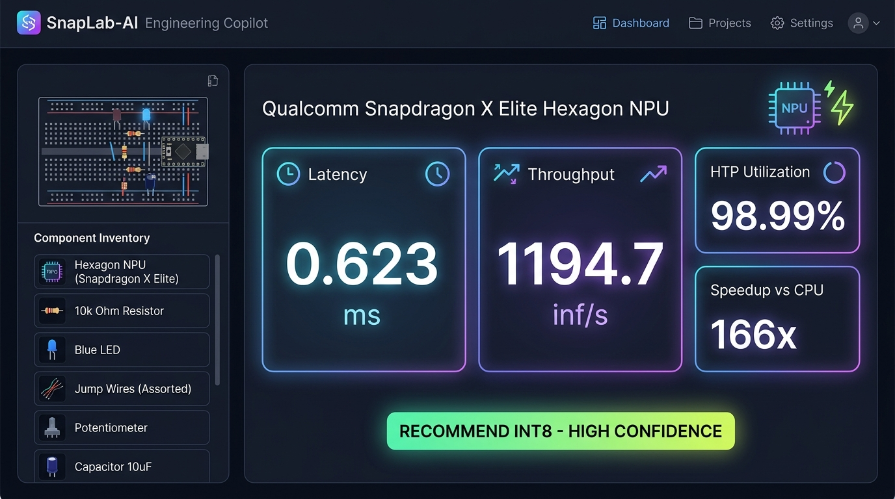
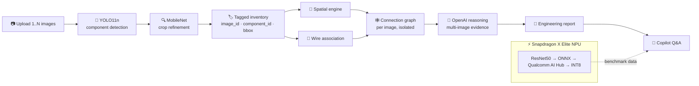
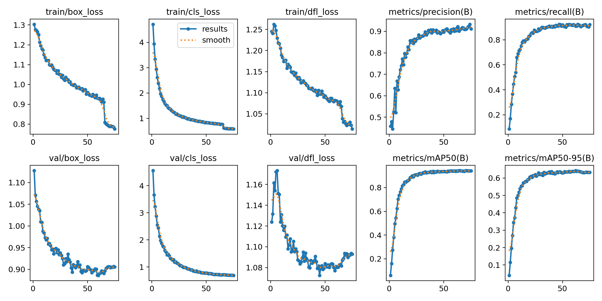

<p align="center">
  
</p>

<h1 align="center">🔬 SnapLab-AI</h1>
<p align="center"><b>Snap a photo of any electronics project → get detected components, wiring topology and an AI engineering report — running on the Snapdragon NPU.</b></p>

<p align="center">
  
  
  
  
  
  
  
  
</p>

---

## ⚡ At a Glance

| 🧠 Models | 🛠️ Core Tools | 📦 Dataset | 🚀 Headline Result |
|:--|:--|:--|:--|
| **YOLO11n** — component detection<br>**MobileNet** — crop-level class refinement<br>**ResNet50** — on-device NPU benchmark model<br>**OpenAI LLM / VLM** — engineering reasoning | Qualcomm AI Hub · Snapdragon X Elite NPU (HTP / QNN) · ONNX Runtime · Ultralytics · PyTorch · OpenCV · Gradio | **17,024 images** across **65 component classes**<br>split into train / val / test | **0.623 ms** INT8 latency<br>**166× faster** than CPU<br>**1,194 inferences / sec** |

<p align="center">
  
  
  
  
</p>

---

## 📑 Table of Contents
- [The Problem](#-the-problem)
- [What SnapLab-AI Does](#-what-snaplab-ai-does)
- [Demo](#-demo)
- [How It Works](#-how-it-works)
- [Models & Tools](#-models--tools)
- [Dataset](#-dataset)
- [Benchmarks on Snapdragon](#-benchmarks-on-snapdragon)
- [Engineering Copilot](#-engineering-copilot)
- [Project Structure](#-project-structure)
- [Quick Start](#-quick-start)
- [Roadmap](#-roadmap)

---

## ❓ The Problem

Students, hobbyists and lab instructors constantly deal with breadboards and dev boards where nobody is sure **what is on the board, how it is wired, or why it doesn't work**. Debugging means manually identifying every part and tracing every jumper. Cloud AI tools are slow, need connectivity, and send lab images off-device.

## 💡 What SnapLab-AI Does

> **Upload one or more photos of a circuit → SnapLab-AI identifies every component, maps how they sit and connect, and writes an engineering report you can question in plain English.**

| | Capability | Where it lives |
|:-:|:--|:--|
| 🎯 | **Detects components** (e.g. `Resistor`, `LED-Light`, `Arduino-Uno`) with YOLO11n | `yolo11n.pt`, `vision/` |
| 🔍 | **Refines each crop** with a MobileNet classifier to fix low-confidence YOLO labels | `vision/` |
| 📐 | **Spatial reasoning** — `LEFT_OF`, `RIGHT_OF`, `ABOVE`, `BELOW`, `NEAR` between every pair | `spatial_engine.py` |
| 🔌 | **Wire association** — links detected wires to the components they touch | `wire_association.py` |
| 🕸️ | **Connection graph** — builds the circuit topology from spatial + wire evidence | `connection_engine.py`, `connection_graph.py` |
| 🖼️ | **Multi-image sessions** with a unified inventory and strict *no cross-image wiring* guardrail | `implementation_plan.md` |
| 🧾 | **Engineering report** combining all evidence, reasoned by an LLM | `engineering_report.py`, `engineering_analyzer.py` |
| ⚙️ | **On-device NPU deployment** on Snapdragon X Elite via Qualcomm AI Hub (INT8) | `snapdragon_executor.py`, `benchmarks/` |
| 💬 | **Engineering Copilot** — ask *"Should I deploy INT8?"* and get an evidence-backed answer | `copilot_app.py`, `copilot_reasoning.py` |

---

## 🎬 Demo

<!-- 👉 Visual demonstration images in /asset -->
<p align="center">
  
  &nbsp;
  
</p>
<p align="center"><i>Left: YOLO11n + MobileNet detections on a breadboard. Right: the Engineering Copilot dashboard with live NPU KPIs.</i></p>

<details>
<summary><b>📄 Sample report output (click to expand)</b></summary>

```text
## 📊 Combined Multi-Image Engineering Report
Images processed : 2
Total detections : 9

| Component Class | Total Detections | Appearing In Images |
|-----------------|------------------|---------------------|
| Resistor        | 4                | Image 1, Image 2    |
| LED-Light       | 3                | Image 1             |
| Arduino-Uno     | 2                | Image 1, Image 2    |

ID 1 (Resistor) -> ID 2 (LED-Light) | Distance: 100.0 px | RIGHT_OF, NEAR

⚠ Components across different images are NOT inferred to be physically connected.
```
</details>

---

## 🧩 How It Works



<details>
<summary><b>🔎 Pipeline deep-dive</b></summary>

1. **Detection** — every uploaded image goes through YOLO11n. Each detection is tagged with `image_id`, `component_id` (`img{n}_c{track_id}`), bounding box, class and confidence.
2. **Refinement** — each crop is re-classified by MobileNet; the final label records its `source` (YOLO or refined) so the report stays traceable.
3. **Spatial relations** — `SpatialRelationshipEngine` computes pairwise distance and direction; pairs within 150 px are marked `NEAR`.
4. **Wiring** — wire detections are associated with component boxes to produce candidate connections.
5. **Isolation guardrail** — spatial pairs, wire traces and graph edges are partitioned by `image_id`, so two photos are never "wired together" by mistake.
6. **Reasoning** — the aggregated evidence (inventory, class frequency, per-image evidence, VLM findings) is sent to the reasoning engine, which separates *total detections* from *unique physical parts*.
7. **Resilience** — a corrupt image produces an inline error entry instead of crashing the session.
</details>

---

## 🧠 Models & Tools

| Layer | Model / Tool | Why we chose it |
|:--|:--|:--|
| Detection | **YOLO11n** (Ultralytics) | Nano-size, real-time, edge-friendly (94.2% mAP@50) |
| Classification | **MobileNet** | Lightweight second opinion on each crop (94.87% accuracy) |
| NPU benchmark | **ResNet50** (1×3×224×224) | Standard reference model to prove the deployment path |
| Edge runtime | **Qualcomm AI Hub** → Snapdragon X Elite **NPU (HTP / QNN)** | Compile, quantize (INT8) and profile on real hardware |
| CPU baseline | **ONNX Runtime** | Fair FP32 comparison point |
| Reasoning | **OpenAI** LLM / VLM | Turns raw evidence into an engineering explanation |
| Vision utils | **OpenCV**, **PyTorch** | Image I/O, crops, model export |
| UI | **Gradio** | Multi-image upload, galleries, Copilot dashboard |

---

## 📦 Dataset

The component classifier is trained on a custom dataset in `datasets/component_classifier/` with **train / val / test** splits across **65 electronics classes**.

| Split | Images |
|:--|--:|
| 🏋️ Train | **12,283** |
| 🧪 Validation | **3,592** |
| ✅ Test | **1,149** |
| **Total** | **17,024** |

<details>
<summary><b>📊 Per-class distribution (click to expand)</b></summary>

| Class | Train | Val | Test | Total |
|:--|--:|--:|--:|--:|
| Resistor | 651 | 141 | 18 | 810 |
| Diode | 575 | 84 | 2 | 661 |
| BJT-Transistor | 542 | 203 | 27 | 772 |
| LED-Light | 426 | 11 | 0 | 437 |
| Generic-Capacitor | 418 | 70 | 0 | 488 |
| MOSFET | 382 | 200 | 21 | 603 |
| Cable | 364 | 76 | 0 | 440 |
| OP-Amp | 326 | 70 | 0 | 396 |
| Variable-Resistor | 322 | 68 | 0 | 390 |
| Push-Switch | 318 | 18 | 0 | 336 |
| IC-Chip | 315 | 22 | 2 | 339 |
| Inductor | 275 | 18 | 0 | 293 |
| OLED-Display | 269 | 10 | 0 | 279 |
| Buzzer | 254 | 18 | 0 | 272 |
| MLC-Capacitor | 252 | 40 | 0 | 292 |
| High-Voltage-Ceramic-Capacitor | 239 | 18 | 0 | 257 |
| Bluetooth-Module | 232 | 17 | 0 | 249 |
| Sonar-Sensor | 206 | 29 | 0 | 235 |
| Gas-Sensor | 204 | 17 | 0 | 221 |
| Breadboard | 196 | 32 | 20 | 248 |
| Arduino-Uno | 196 | 23 | 1 | 220 |
| Arduino-Mega | 196 | 29 | 19 | 244 |
| ESP32 | 180 | 10 | 2 | 192 |
| ESP32-CAM | 73 | 37 | 82 | 192 |
| Servo-Motor | 160 | 11 | 3 | 174 |
| Relay-Module | 158 | 45 | 25 | 228 |
| DC-Motor | 51 | 31 | 89 | 171 |

*65 total hardware classes covering microcontrollers, passives, semiconductors, modules, and sensors.*

Reproduce these numbers any time with:
```bash
python check_dataset.py
```
</details>

---

## 🚀 Benchmarks on Snapdragon

<p align="center">
  
</p>

| Configuration | Device | Runtime | Latency | Peak memory |
|:--|:--|:--|--:|--:|
| FP32 | CPU | ONNX Runtime | 103.711 ms (mean) | — |
| FP32 source | Snapdragon X Elite CRD | Qualcomm AI Hub | 1.830 ms | 81.1 MB |
| FP32 compiled | Snapdragon X Elite CRD | Qualcomm AI Hub | 1.822 ms | 81.1 MB |
| **INT8** | **Snapdragon X Elite CRD** | **AI Hub / NPU** | **0.623 ms** | **54.7 MB** |

| 📈 Key result | Value |
|:--|--:|
| CPU → INT8 speedup | **166.5×** |
| Compiled FP32 → INT8 latency reduction | **65.8 %** |
| FP32 → INT8 memory reduction | **32.6 %** |
| NPU (HTP) utilization | **98.99 %** |
| Throughput | **1,194.7 inferences / s** |
| Graph nodes on HTP | 1,357 |

<details>
<summary><b>🎯 Accuracy consistency (FP32 vs INT8)</b></summary>

| Metric | Value |
|:--|--:|
| Validation samples | 10 |
| Top-1 agreement | 100 % |
| Mean cosine similarity | 0.9845 |
| Min cosine similarity | 0.9818 |
| Mean absolute error | 0.1286 |

> ⚠️ **Honest note:** this is a prediction-consistency test on synthetic inputs, not ImageNet accuracy. Labeled real-world validation is the next step before production.
</details>

---

## 💬 Engineering Copilot

`copilot_app.py` is a Gradio dashboard that loads `engineering_report.json` and shows live KPIs (NPU latency, throughput, HTP utilization, speedup, memory, Top-1 agreement) plus an automatic decision:

> ### ⚙️ Recommendation: **RECOMMEND INT8** — Confidence: **HIGH**
> INT8 cuts latency by 65.81 %, memory by 32.57 %, runs the NPU at 98.99 % utilization, and keeps 100 % Top-1 agreement.

Try asking it:
- *"Should I deploy the INT8 model?"*
- *"How much faster is the NPU than the CPU?"*
- *"What are the risks of quantization here?"*

---

## 🗂️ Project Structure

<details>
<summary><b>Click to expand</b></summary>

```text
SNAPLAB_AI/
├── asset/                     # README images & screenshots
├── assets/                    # Project showcase imagery & Qualcomm branding
├── benchmarks/                # Qualcomm AI Hub profiling scripts/results
├── vision/                    # Detection + refinement + OpenAI reasoning (Gradio app)
├── app.py                     # Flagship circuit inspector launcher
├── copilot_app.py             # Engineering Copilot dashboard (Gradio)
├── copilot_reasoning.py       # Copilot Q&A logic
├── spatial_engine.py          # Pairwise spatial relationships
├── wire_association.py        # Wire ↔ component linking
├── connection_engine.py       # Connection inference
├── connection_graph.py        # Circuit topology graph
├── engineering_analyzer.py    # Evidence aggregation
├── engineering_report.py      # Report builder
├── engineering_state.py       # Shared session state
├── recommendation_engine.py   # INT8 vs FP32 decision logic
├── performance_comparison.py  # Speedup / memory computation
├── snapdragon_executor.py     # Snapdragon NPU execution
├── create_resnet.py           # ResNet50 export
├── test_inference.py          # Inference sanity test
├── check_dataset.py           # Dataset split statistics
├── benchmark_results.json     # Raw benchmark numbers
├── engineering_report.json    # Report consumed by the Copilot
└── yolo11n.pt                 # Detection weights
```
</details>

---

## 🏁 Quick Start

```bash
# 1. Clone
git clone https://github.com/iblamepuru/SNAPLAB_AI.git
cd SNAPLAB_AI

# 2. Setup Virtual Environment
python -m venv .venv
.\.venv\Scripts\Activate.ps1  # Windows PowerShell

# 3. Install Dependencies
pip install -r requirements.txt

# 4. Add your API key (never commit this file)
echo "GROQ_API_KEY=your_key_here" > .env

# 5. Launch the Flagship Circuit Inspector
python app.py

# 6. Launch the Engineering Copilot Dashboard
python copilot_app.py
```

---

## 🛣️ Roadmap

- [x] YOLO11n + MobileNet two-stage detection (65 classes)
- [x] Spatial, wire and connection-graph engines
- [x] Multi-image sessions with cross-image isolation
- [x] ResNet50 INT8 on Snapdragon X Elite NPU (0.623 ms)
- [x] Engineering Copilot dashboard with live KPIs
- [ ] Run the full YOLO + MobileNet pipeline on the NPU
- [ ] Labeled real-world accuracy validation
- [ ] Fault detection (reversed LED, missing resistor, short circuits)
- [ ] Live camera mode

---

<p align="center">
  <b>SnapLab-AI</b> · Qualcomm AI Hub · Snapdragon X Elite · YOLO11n · MobileNet · ResNet50 · INT8 NPU<br/>
  <sub>Made with ⚡ by <a href="https://github.com/iblamepuru">@iblamepuru</a></sub>
</p>
