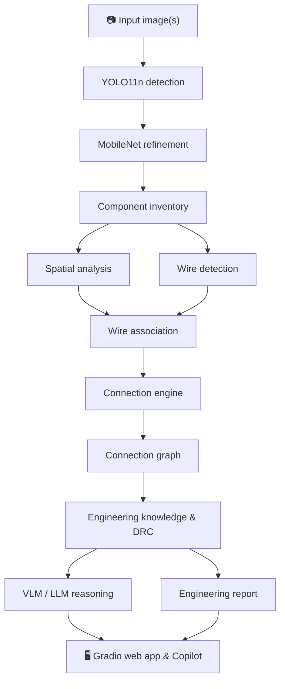

<div align="center">

# ⚡ SnapLab AI

### Real-Time On-Device Engineering Copilot for Snapdragon AI PCs

**Photograph a circuit. Get a component inventory, spatial and wiring evidence, a connection graph and an explainable engineering report.**

[](https://iblamepuru--snaplab-ai-web.modal.run/)
[](#-installation)
[](#-computer-vision-pipeline)
[](#-qualcomm-snapdragon--npu)
[](#-using-the-web-app)

**🌐 Live website:** https://iblamepuru--snaplab-ai-web.modal.run/
**📘 User guide:** [`userguide.md`](userguide.md)


</div>

---

## 📑 Table of Contents

- [Overview](#-overview)
- [Key Features](#-key-features)
- [System Architecture](#-system-architecture)
- [Computer Vision Pipeline](#-computer-vision-pipeline)
- [Circuit Intelligence](#-circuit-intelligence)
- [Evidence & Explainability](#-evidence--explainability)
- [Qualcomm Snapdragon & NPU](#-qualcomm-snapdragon--npu)
- [Dataset](#-dataset)
- [Screenshots](#-screenshots)
- [Installation](#-installation)
- [Using the Web App](#-using-the-web-app)
- [Deployment](#-deployment)
- [Project Structure](#-project-structure)
- [Configuration & Security](#-configuration--security)
- [Limitations](#-limitations)
- [Roadmap](#-roadmap)

---

## 🔍 Overview

Reading a circuit from a photo means identifying every part, tracing wires, working out which components interact and looking up datasheets. That work is slow, especially for students and for engineers facing unfamiliar hardware.

**SnapLab AI** is an AI-assisted visual engineering analysis platform. It turns one or more photographs of electronic components or circuit setups into:

```text
COMPONENT INVENTORY  +  SPATIAL UNDERSTANDING  +  WIRE / CIRCUIT RELATIONSHIPS
                     +  ENGINEERING INTERPRETATION  +  EXPLAINABLE REPORT
```

Every result carries its level of evidence, so users can see what was **observed**, **predicted**, **inferred**, **recommended** or **still unresolved**.

> ⚠️ SnapLab AI reasons from images. It is **not** a multimeter, oscilloscope or electrical verification system, and it cannot prove continuity from a photo. Verify important conclusions physically.

---

## ✨ Key Features

| Area | What SnapLab AI does |
|---|---|
| 🎯 **Detection** | YOLO11n detects electronic components across a 65-class electronics taxonomy |
| 🔬 **Refinement** | MobileNet classifier re-checks each crop; YOLO, refined and final labels are kept separately |
| 📋 **Inventory** | Structured records with image ID, component ID, bounding box, confidence, source and category |
| 📐 **Spatial reasoning** | LEFT_OF / RIGHT_OF / ABOVE / BELOW / NEAR relationships and pixel distances |
| 🧵 **Wire analysis** | Wire detection, endpoint identification and wire-to-component association |
| 🕸️ **Connection graph** | Evidence-tiered graph of candidate connections per image |
| 🖼️ **Multi-image analysis** | Several photos per session, with a strict no-cross-image-wiring guardrail |
| 📚 **Engineering knowledge** | Component roles, pin/terminal guidance, category information and safety notes |
| ✅ **Circuit Verification & DRC** | Rule-based findings with reason, evidence, affected parts and suggested checks |
| 🧠 **VLM / LLM reasoning** | InternVL-class vision-language model and optional Groq/OpenAI engineering reasoning |
| 🔎 **Explainability** | Evidence broken into visual, model, geometric, wire, knowledge, reasoning and unresolved layers |
| 🤖 **Engineering Copilot** | Answers questions about benchmark and deployment evidence from `engineering_report.json` |
| ⚡ **Edge AI** | Qualcomm AI Hub workflow targeting Snapdragon X Elite (HTP / QNN, INT8) |

---

## 🏗️ System Architecture



Each stage is a separate module, so it can be tested, improved or disabled on its own. Optional services such as the VLM and LLM fail gracefully and do not stop the base detector.

---

## 👁️ Computer Vision Pipeline

### 1. Detection — YOLO11n
Ultralytics YOLO11n (`models/best.pt`) locates components and returns class, confidence and bounding box.

### 2. Refinement — MobileNet
Each detection is cropped and re-classified by the component classifier (`models/component_classifier/best.pt`, classes in `classes.json`). The fusion engine compares both opinions:

| Status | Meaning |
|---|---|
| `REFINED` | Both models agree, or refinement is confident enough to update the label |
| `UNCERTAIN` | The models disagree or refinement confidence is too low; the YOLO label is kept and flagged |

### 3. Inventory record

```json
{
  "component_id": "img1_c3",
  "image_id": "img1",
  "class_name": "ESP32-CAM",
  "confidence": 0.998,
  "bbox": [x1, y1, x2, y2],
  "source": "MobileNet",
  "status": "REFINED",
  "engineering_category": "Embedded Vision Module"
}
```

---

## 🧩 Circuit Intelligence

| Stage | Output | Evidence type |
|---|---|---|
| Spatial engine | Relative positions, distances (NEAR ≈ 150 px) | Geometric inference |
| Wire detector | Wire masks and endpoints | Visual segmentation |
| Wire association | Wire ↔ component candidates | Heuristic |
| Connection engine | Candidate edges with reasons | Inferred |
| Engineering ontology | Plausible relationships (e.g. controller → actuator) | Domain knowledge |


The connection graph draws three evidence tiers differently:

- 🟡 **Directly observed**: verified contact visible in the image
- 🔵 **Heuristic candidate**: possible wire path from segmentation
- 🟣 **Ontology possibility**: plausible from engineering knowledge

> `Spatial relation ≠ Electrical connection`

### 🚫 No cross-image wiring
Every detection keeps its `image_id`. Spatial relations, wire candidates and graph edges are computed **per image only**. The session report can aggregate inventories across photos, but it never creates a connection just because two parts appear in the same session. It also separates *total detections* from *unique physical components*.

---

## 🔎 Evidence & Explainability


Each component can be inspected through these evidence layers:

| Layer | Question it answers |
|---|---|
| **A. Direct visual evidence** | What is visibly present? |
| **B. Model prediction** | What did YOLO11n and MobileNet predict? |
| **C. Geometric inference** | What follows from coordinates and positions? |
| **D. Wire evidence** | What did wire processing find? |
| **E. Engineering knowledge** | What does the ontology suggest? |
| **F. VLM / LLM reasoning** | What do higher-level models infer from the evidence? |
| **G. Unresolved items** | What needs physical checking or a better photo? |

Confidence values are model scores, not guarantees of correctness.

---

## ⚡ Qualcomm Snapdragon & NPU

SnapLab AI includes a Qualcomm edge-AI workflow built with **Qualcomm AI Hub**, targeting the **Snapdragon X Elite CRD** (Hexagon HTP, QNN, INT8, ONNX / ONNX Runtime). The VLM subsystem uses an InternVL-class model bundle through the GenieX / QAIRT runtime.

### ResNet50 NPU benchmark

ResNet50 is used as a **standard benchmark model** to measure the Snapdragon NPU pipeline.

| Configuration | Latency |
|---|---:|
| FP32 CPU (ONNX Runtime) | ~103.711 ms |
| FP32 source on Snapdragon X Elite | ~1.830 ms |
| FP32 compiled | ~1.822 ms |
| **INT8 NPU** | **~0.623 ms** |

| Metric | Value |
|---|---:|
| CPU → INT8 speedup | ~166.5× |
| Compiled FP32 → INT8 latency reduction | ~65.8% |
| FP32 → INT8 memory reduction | ~32.6% |
| HTP utilization | ~98.99% |
| Throughput | ~1,194.7 inferences/s |
| Graph nodes on HTP | 1,357 |

### FP32 vs INT8 consistency check

| Metric | Value |
|---|---:|
| Validation samples | 10 |
| Top-1 agreement | 100% |
| Mean cosine similarity | 0.9845 |
| Minimum cosine similarity | 0.9818 |
| Mean absolute error | 0.1286 |

> 📌 These figures come from the documented ResNet50 benchmark setup (see `benchmark_results.json`). They are **not** the end-to-end latency of the SnapLab AI website. They also do not mean every YOLO inference runs on the NPU. The consistency check covers 10 samples and is not a full accuracy evaluation.

---

## 📊 Dataset

A custom electronics dataset covering **65 component classes**, including resistors, capacitors, diodes, transistors, MOSFETs, LEDs, ICs, inductors, breadboards, Arduino and ESP32 boards, relay modules, sensors, motors, switches, displays, cables and communication modules.

| Split | Images |
|---|---:|
| Train | 12,283 |
| Validation | 3,592 |
| Test | 1,149 |
| **Total** | **17,024** |

Dataset tooling: `check_dataset.py`, `tools/prepare_stage1_dataset.py`, `tools/train_component_classifier.py`, `tools/evaluate_component_classifier.py`, `tools/preview_classifier_crops.py`.
The dataset is kept local and is not committed to the repository.

---

## 🖼️ Screenshots

| Component inventory & reasoning | Engineering report |
|---|---|
|  |  |

| Multi-image comparison |
|---|
|  |

More step-by-step screenshots are in [`docs/userguide_images/`](docs/userguide_images/).

---

## 🛠️ Installation

### Prerequisites
- Python 3 (check `requirements.txt` for the supported version)
- Git
- Model files: `models/best.pt`, `models/component_classifier/best.pt`, `models/component_classifier/classes.json`

### Windows (PowerShell)

```powershell
git clone https://github.com/iblamepuru/SnapLabAI.git
cd SnapLabAI

python -m venv venv
.\venv\Scripts\Activate.ps1

pip install -r requirements.txt

# Optional: API keys for LLM reasoning (never commit these)
$env:GROQ_API_KEY = "your-key"
$env:OPENAI_API_KEY = "your-key"

python app.py
```

### Linux / macOS

```bash
git clone https://github.com/iblamepuru/SnapLabAI.git
cd SnapLabAI
python3 -m venv venv
source venv/bin/activate
pip install -r requirements.txt
python app.py
```

Then open **http://127.0.0.1:7860**.

---

## 🖥️ Using the Web App

1. Open the [live website](https://iblamepuru--snaplab-ai-web.modal.run/) or your local instance.
2. **Upload** one or more circuit images (JPG, PNG, WEBP).
3. Choose an **analysis mode**:
   - **Component Identification**: identify parts only
   - **Circuit Analysis**: add spatial, wire, connection and engineering reasoning
4. Set **YOLO confidence**. A lower value gives more candidates and more false positives; a higher value gives fewer candidates and more missed parts.
5. Toggle **MobileNet refinement** and the other analysis options (connections, engineering relationships, Qualcomm VLM, engineering reasoning).
6. Click **Run Analysis**.
7. Explore the result tabs: **Analysis Report**, **Connection Graph**, **Multi-Image Comparison**, **Evidence & Explainability**, **Component Specs & Datasets**, **Circuit Verification & DRC**, **Spatial Layout** and **Engineering Insights**.
8. **Verify** important conclusions on the physical circuit.

📘 The full walkthrough is in [`userguide.md`](userguide.md).

---

## ☁️ Deployment

| Target | Entry point | Notes |
|---|---|---|
| Local | `python app.py` | Serves on `127.0.0.1:7860`; respects `PORT`, `SERVER_NAME`, `RENDER` |
| Modal (cloud) | `modal_app.py` | Public site: https://iblamepuru--snaplab-ai-web.modal.run/ |
| Snapdragon device | `snapdragon_executor.py`, `vision/snapdragon_npu_adapter.py` | Needs Snapdragon X Elite hardware and the Qualcomm runtime |

```bash
# Deploy to Modal
modal deploy modal_app.py
```

> A standard cloud container does not provide the Snapdragon NPU. The on-device and cloud paths are separate.

---

## 📁 Project Structure

```text
SnapLabAI/
├── app.py                          # Local launcher (imports vision.component_inspector_v2)
├── modal_app.py                    # Modal cloud deployment
├── index.html
├── copilot_app.py                  # Engineering Copilot UI
├── copilot_reasoning.py
├── spatial_engine.py
├── wire_association.py
├── connection_engine.py
├── connection_graph.py
├── engineering_analyzer.py
├── engineering_report.py
├── engineering_state.py
├── recommendation_engine.py
├── performance_comparison.py
├── snapdragon_executor.py
├── create_resnet.py                # ResNet50 benchmark model
├── test_inference.py
├── check_dataset.py
├── benchmark_results.json
├── engineering_report.json
├── userguide.md
├── models/
│   ├── best.pt                     # YOLO11n component detector
│   ├── snaplab_v3_npu_manifest.json
│   └── component_classifier/
│       ├── best.pt                 # MobileNet refinement model
│       └── classes.json
├── vision/
│   ├── component_inspector_v2.py   # Flagship Gradio application
│   ├── component_refinement_engine.py
│   ├── component_fusion_engine.py
│   ├── component_knowledge.py
│   ├── engineering_ontology.py
│   ├── circuit_intelligence.py
│   ├── crop_engine.py
│   ├── spatial_engine.py
│   ├── relationship_engine.py
│   ├── wire_detector.py / wire_detector_v3.py
│   ├── wire_association.py
│   ├── connection_engine.py / connection_graph.py
│   ├── openai_engine.py
│   ├── snapdragon_npu_adapter.py
│   └── vlm/
│       ├── vlm_engine.py
│       ├── vlm_prompt.py
│       └── vlm_deployment.json
├── tools/                          # Dataset & classifier training tools
└── docs/
    ├── userguide.md
    ├── userguide_images/
    └── screenshots/
```

---

## 🔐 Configuration & Security

| Variable | Purpose |
|---|---|
| `GROQ_API_KEY` | Optional Groq-backed engineering reasoning |
| `OPENAI_API_KEY` | Optional OpenAI-backed engineering reasoning |
| `PORT`, `SERVER_NAME` | Server binding for cloud or server runs |

- Never commit `.env`, API keys or tokens. Store Modal secrets in Modal.
- Large datasets, temporary benchmarks and hardware-specific bundles are excluded through `.gitignore`.
- If no API key is set, the app falls back to the built-in engineering rule engine.

---

## ⚠️ Limitations

- Visual inference is **not** electrical verification. It does not replace continuity testing, simulation or datasheet review.
- Hidden, crossing or similarly coloured wires reduce wire-tracing reliability.
- Engineering specs are **class-level** guidance. Check exact part numbers against manufacturer datasheets.
- DRC findings are engineering assistance, not absolute truth.
- NPU benchmark figures apply to the ResNet50 benchmark, not the full hosted pipeline.

---

## 🗺️ Roadmap

Planned work (**not yet implemented**):

- [ ] Full YOLO + MobileNet deployment on the Snapdragon NPU
- [ ] Broader real-world validation with per-class precision, recall and F1
- [ ] Fault detection: reversed LEDs, missing resistors, shorts and opens
- [ ] Live camera mode
- [ ] Stronger wire tracing and connection confidence
- [ ] Component-level datasheet retrieval
- [ ] PCB-aware analysis and schematic generation
- [ ] Richer Engineering Copilot

---

<div align="center">

**SnapLab AI** — from seeing a circuit to understanding it.

[🌐 Live Demo](https://iblamepuru--snaplab-ai-web.modal.run/) · [📘 User Guide](userguide.md) · [💻 Repository](https://github.com/iblamepuru/SnapLabAI)

</div>
