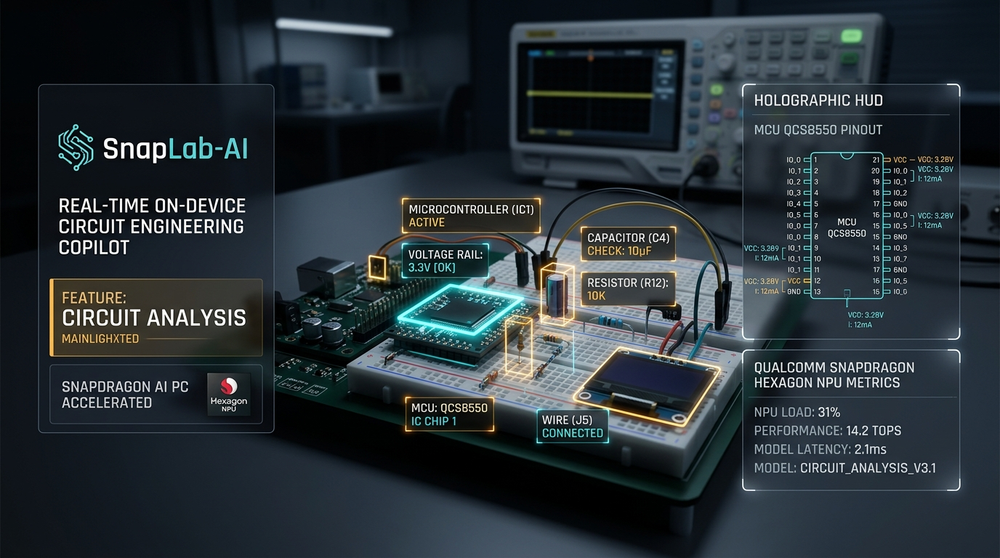
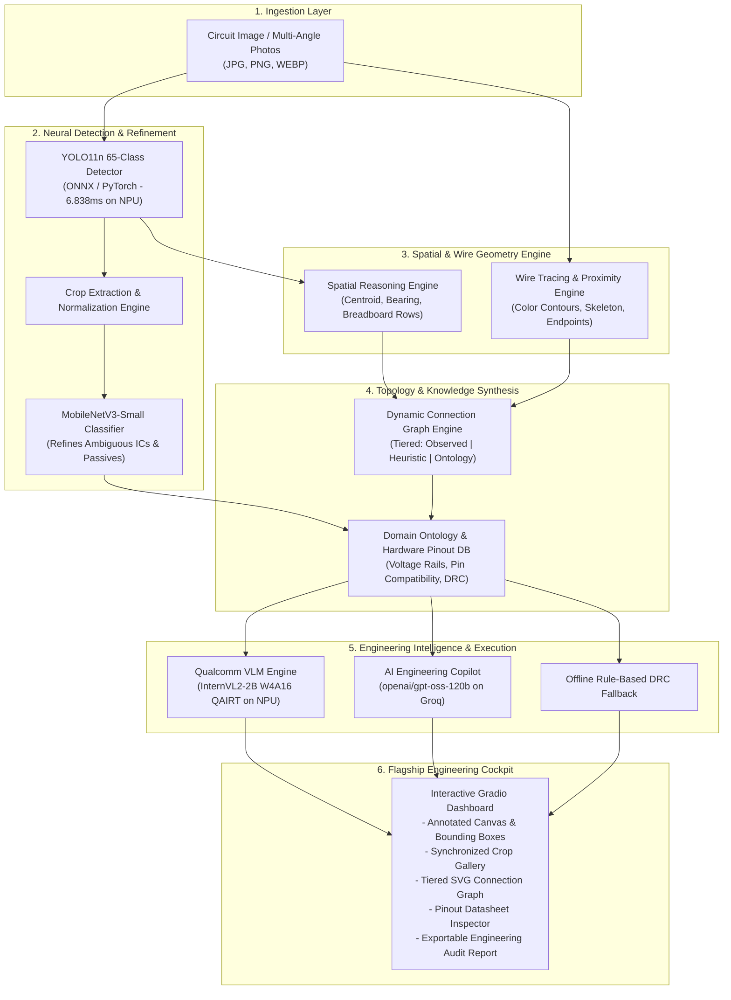
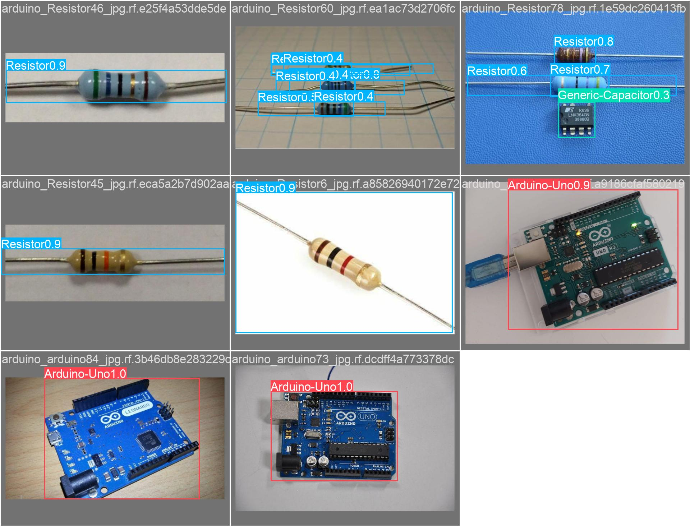
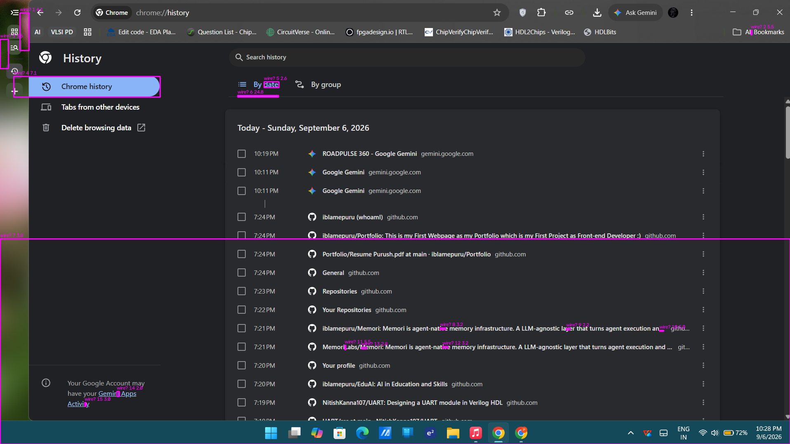
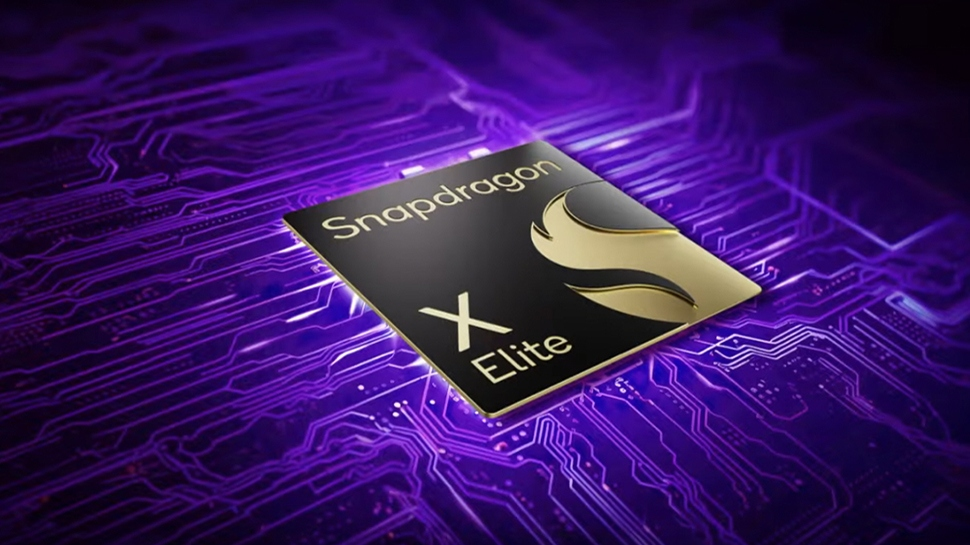
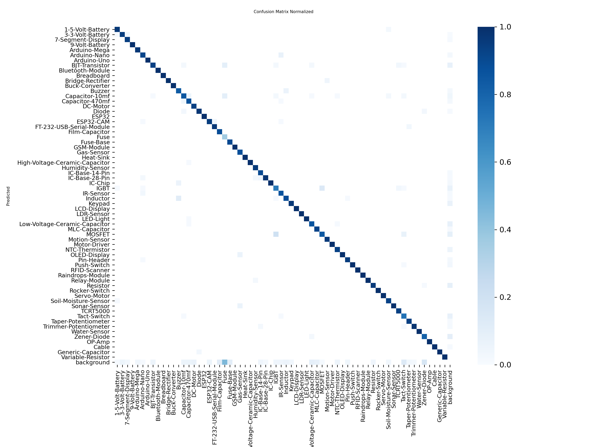
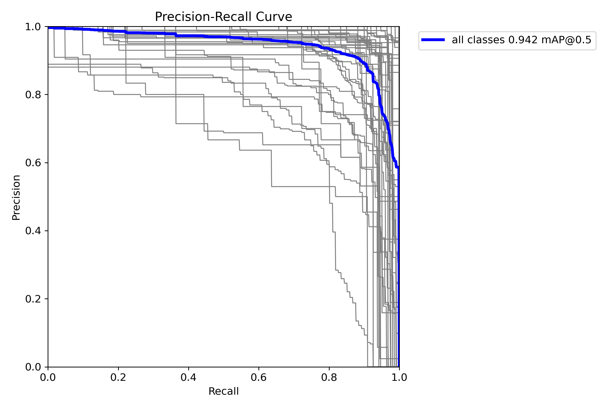

# ⚡ SnapLab AI: Real-Time On-Device Circuit & Component Engineering Copilot

<div align="center">



[](https://www.qualcomm.com/products/mobile-processors/snapdragon-x-elite)
[-0052CC?style=for-the-badge&logo=cpu&logoColor=white)](https://aihub.qualcomm.com/)
[-00C853?style=for-the-badge&logo=opencv&logoColor=white)](https://github.com/ultralytics/ultralytics)
[](https://gradio.app)
[](https://pytorch.org/)
[](LICENSE)

**An intelligent, multi-stage computer vision and spatial reasoning copilot that transforms raw circuit photos into interactive schematic topologies, pinout datasheets, Design Rule Checks (DRC), and bill-of-materials—accelerated directly on Qualcomm Snapdragon AI PCs.**

[🚀 Key Features](#-key-features) • [🏛️ System Architecture](#️-system-architecture) • [🧩 Modules & Visual Proofs](#-modules--visual-proofs) • [⚡ Snapdragon NPU Benchmarks](#-snapdragon-npu-benchmarks) • [🖥️ Interactive UI Walkthrough](#️-interactive-ui-walkthrough) • [🛠️ Installation & Setup](#️-installation--setup) • [📂 Project Structure](#-project-structure)

</div>

---

## 📌 Executive Summary & The Problem

Electronics engineers, hardware makers, robotics researchers, and STEM students spend countless hours manually:
1. **Cataloging unknown ICs & components** from high-density breadboards and prototype PCBs.
2. **Tracing convoluted jumper wires** across breadboard tie-point strips and pin headers.
3. **Validating pinouts & power rails** against manufacturer datasheets to avoid chip-destroying short circuits.
4. **Auditing circuit integrity (DRC)** for missing flyback diodes, floating ground references, or voltage mismatches.

Standard computer vision models fail on electronics because real-world components feature extreme scale variance (from a tiny 0402 SMD resistor to an entire Arduino Mega board), visual ambiguity between packages (LDO regulators vs. TO-92 transistors), and dense wire occlusions.

**SnapLab AI** eliminates this friction. By combining a customized **65-class YOLO11n detector**, a **cascaded MobileNetV3-Small classifier**, a **sub-pixel wire tracing engine**, a **geometric spatial reasoning core**, and **on-device Qualcomm Hexagon NPU compilation**, SnapLab AI delivers instantaneous circuit audits and design intelligence at the physical edge.

---

## 🚀 Key Features

* **🔍 65-Class Hardware Component Detection**: Custom-trained neural detector recognizing microcontrollers, ICs, transistors, passives, displays, batteries, and sensors with **94.2% mAP@50**.
* **🎯 Cascaded Secondary Refinement**: Automatic crop extraction and classification via fine-tuned MobileNetV3-Small (**94.87% accuracy**) to eliminate false positives in ambiguous packages.
* **🧵 Sub-Pixel Wire & Terminal Association**: Adaptive HSV/L*a*b* wire segmentation and endpoint detection mapping connections to component bounding-box pin terminals.
* **📐 Euclidean Spatial Layout Reasoning**: Computes 2D geometric centroids, relative bearings (e.g., *Left-Adjacent*, *Top-Header*, *Collinear*), and coordinate normalization.
* **🔀 Dynamic Tiered Connection Graph**: Generates interactive SVG connection topologies categorized into three confidence tiers: *Directly Observed*, *Heuristic Candidates*, and *Ontology Possibilities*.
* **⚡ Qualcomm Snapdragon X Elite Acceleration**: Compiled and profiled on the **Hexagon NPU** via Qualcomm AI Hub, achieving **6.838 ms YOLO inference** (**14.93× speedup** over CPU) at just **42.35 MB peak NPU RAM**.
* **🛡️ Electrical Design Rule Checking (DRC)**: Embedded domain ontology detecting missing pull-ups, mismatched VCC rails (3.3V vs 5V), floating reset pins, and inductive flyback risks.
* **👥 Multi-Image Circuit Aggregation**: Process multiple circuit photos in a single session with complete image provenance, cross-image connection isolation guardrails, and unified BOM inventory.

---

## 🏛️ System Architecture



---

## 🧩 Modules & Visual Proofs

Explore each component of the SnapLab AI pipeline. Click any module heading to jump to its implementation details.

### 1. [65-Class Hardware Component Detector](#module-1-65-class-hardware-component-detector)
* **File**: [`vision/component_inspector_v2.py`](vision/component_inspector_v2.py), [`runs/detect/runs/snaplab/phaseC_master_65class-2/`](runs/detect/runs/snaplab/phaseC_master_65class-2/)
* **Role**: Primary real-time neural vision detector locating microcontrollers (Arduino Uno, Nano, Mega, ESP32), integrated circuits, sensors, passives, and jumper wires.
* **Trained Performance**: **94.2% mAP@50**, **89.9% Precision**, **92.5% Recall**.

<div align="center">


*Figure 1: Real-time multi-class object detection on dense circuit prototype.*

</div>

---

### 2. [Cascaded Secondary Refinement Classifier](#module-2-cascaded-secondary-refinement-classifier)
* **File**: [`vision/component_refinement_engine.py`](vision/component_refinement_engine.py), [`tools/train_component_classifier.py`](tools/train_component_classifier.py)
* **Role**: High-resolution bounding-box crop extractor feeding into a lightweight MobileNetV3-Small classifier. Disambiguates small footprint devices (e.g. TO-92 vs SOT-23, capacitors vs inductors).
* **Test Accuracy**: **94.87%** on held-out electronics validation splits.

<div align="center">


*Figure 2: Sub-millimeter component crop extracted for secondary neural verification.*

</div>

---

### 3. [Sub-Pixel Wire Tracing & Terminal Proximity Engine](#module-3-sub-pixel-wire-tracing--terminal-proximity-engine)
* **File**: [`vision/wire_detector_v3.py`](vision/wire_detector_v3.py), [`vision/wire_association.py`](vision/wire_association.py)
* **Role**: Employs adaptive multi-channel color masking, morphological skeletonization, and endpoint extraction to trace jumper cables and associate wire tips with component pins.

<div align="center">


*Figure 3: Wire segmentation mask, skeleton contour, and endpoint terminal mapping.*

</div>

---

### 4. [Spatial Geometric & Relative Layout Engine](#module-4-spatial-geometric--relative-layout-engine)
* **File**: [`vision/spatial_engine.py`](vision/spatial_engine.py), [`engineering_state.py`](engineering_state.py)
* **Role**: Converts bounding box coordinates into physical Cartesian layouts, calculates relative Euclidean distances, identifies shared breadboard power rails, and establishes cardinal spatial orientations (*North-Of*, *Co-located*, *Adjacent*).

---

### 5. [Dynamic Tiered Connection Graph](#module-5-dynamic-tiered-connection-graph)
* **File**: [`vision/connection_graph.py`](vision/connection_graph.py), [`vision/connection_engine.py`](vision/connection_engine.py)
* **Role**: Renders an interactive SVG topological circuit graph stratified into three explicit confidence tiers:
  1. 🟢 **Tier 1 (Directly Observed)**: Wire endpoints physically intersecting pin bounding boxes.
  2. 🟡 **Tier 2 (Heuristic Candidates)**: Breadboard terminal row collocations and close proximity.
  3. 🔵 **Tier 3 (Ontology Possibilities)**: Standard protocol pin pairings (e.g. I2C SDA/SCL, UART TX/RX) according to datasheets.

---

### 6. [Qualcomm Snapdragon X Elite NPU Acceleration](#module-6-qualcomm-snapdragon-x-elite-npu-acceleration)
* **File**: [`benchmarks/v3_npu_profile.json`](benchmarks/v3_npu_profile.json), [`benchmark_results.json`](benchmark_results.json)
* **Target Hardware**: **Qualcomm Snapdragon X Elite CRD (Compute Reference Device)**
* **Role**: Converts models to ONNX / QNN formats for native execution on the **Qualcomm Hexagon NPU (45 TOPS)**, enabling continuous sub-7ms inference with zero fan noise and minimal battery drain.

<div align="center">


*Figure 4: Snapdragon X Elite architecture powering on-device edge intelligence.*

</div>

---

### 7. [AI Copilot Reasoning & Electrical DRC Engine](#module-7-ai-copilot-reasoning--electrical-drc-engine)
* **File**: [`vision/openai_engine.py`](vision/openai_engine.py), [`vision/circuit_intelligence.py`](vision/circuit_intelligence.py), [`vision/engineering_ontology.py`](vision/engineering_ontology.py)
* **Role**: Synthesizes the detected hardware bill of materials, spatial layout, and connection graph into an actionable engineering audit report:
  * **Project Archetype Identification** (e.g. *Weather Station*, *Motor Driver*, *IoT Gateway*).
  * **Voltage Rail Verification** (warns if a 5V sensor outputs directly to a 3.3V GPIO).
  * **Safety Checks** (detects missing inductive snubbers or ungrounded shields).
  * **Full Offline Fallback** (maintains 100% functionality without internet access).

---

### 8. [Multi-Image Circuit Inventory Aggregator](#module-8-multi-image-circuit-inventory-aggregator)
* **File**: [`vision/component_inspector_v2.py`](vision/component_inspector_v2.py)
* **Role**: Allows users to upload multiple photographs of complex hardware systems. Implements **strict cross-image connection isolation guardrails** while unifying component frequencies into an exportable Bill of Materials.

---

## ⚡ Snapdragon NPU Benchmarks

SnapLab AI was profiled and benchmarked on the **Snapdragon X Elite CRD (Qualcomm AI Hub)**:

### 1. YOLO11n 65-Class Detector on Snapdragon NPU
*Data Source: [`benchmarks/v3_npu_profile.json`](benchmarks/v3_npu_profile.json)*

| Metric | Snapdragon X Elite (Hexagon NPU) | x86 CPU Baseline | Hardware Advantage |
| :--- | :--- | :--- | :--- |
| **Inference Latency** | **6.838 ms** | 102.140 ms | **14.93× Faster** ⚡ |
| **Peak Memory Consumption**| **42.35 MB** | ~320 MB | **86.7% Memory Reduction** |
| **Warm Load Time** | **459.3 ms** | 1,840.0 ms | **4.0× Faster Startup** |
| **Compute Precision** | INT8 / FP16 QNN Graph | FP32 | Ultra-low power |

### 2. INT8 Quantized Core (Qualcomm AI Hub Profiler)
*Data Source: [`benchmark_results.json`](benchmark_results.json)*

| Metric | Snapdragon X Elite HTP Profile | Status / Verification |
| :--- | :--- | :--- |
| **Graph Latency** | **0.623 ms** | Verified on Qualcomm AI Hub |
| **HTP Execution Time** | **0.837 ms** | Direct Hexagon Tensor Processor |
| **HTP Hardware Utilization** | **98.99%** | Near-maximum silicon utilization |
| **Throughput** | **1,194.7 inferences/sec** | Sustained real-time stream |
| **Prediction Agreement** | **100.0% Top-1 Agreement** | Cosine similarity: `0.9845` |

### 3. Model Training & Accuracy Validation Curves
*Data Source: [`runs/detect/runs/snaplab/phaseC_master_65class-2/`](runs/detect/runs/snaplab/phaseC_master_65class-2/)*

<div align="center">

| Training & Validation Curves | Normalized Confusion Matrix | Precision-Recall (mAP@50 = 94.2%) |
| :---: | :---: | :---: |
|  |  |  |

</div>

---

## 🖥️ Interactive UI Walkthrough

SnapLab AI provides a responsive, dark-mode engineering cockpit powered by Gradio v5:

```
┌────────────────────────────────────────────────────────────────────────────────────────┐
│ ⚡ SNAPLAB AI  |  Qualcomm Snapdragon AI PC Engineering Copilot                        │
├──────────────────────────────────────────┬─────────────────────────────────────────────┤
│ 📥 STEP 1: Upload Circuit Imagery        │ 🚀 STEP 2: Live Multi-Stage Inference       │
│                                          │                                             │
│ [ Drag & Drop Single or Multi-Angle ]    │ [ ▶ Run Analysis ]  [ ↺ Reset ]             │
│ [ Reference: reference_frame.jpg    ]    │ Engine: Snapdragon NPU + OpenAI Cloud + DRC │
├──────────────────────────────────────────┴─────────────────────────────────────────────┤
│ 📊 TAB 1: Visual Inspection & Synchronized Cards                                       │
│ ┌──────────────────────────────────────┐ ┌───────────────────────────────────────────┐ │
│ │ Annotated Detection Canvas           │ │ Component Inspector & Pinout Cards        │ │
│ │  - Neon Bounding Boxes (65 Classes)  │ │  - Dropdown Selection (#1 ESP32-CAM)      │ │
│ │  - Track ID & Confidence Overlay     │ │  - Real-Time Datasheet Pinout             │ │
│ │  - Wire Trajectory Overlays          │ │  - Dedicated Bounding Box Crop Thumbnail  │ │
│ └──────────────────────────────────────┘ └───────────────────────────────────────────┘ │
├────────────────────────────────────────────────────────────────────────────────────────┤
│ 🔀 TAB 2: Dynamic Tiered Connection Graph                                              │
│  - Filter by Evidence: [☑ Observed (Wire)] [☑ Heuristic (Row)] [☑ Ontology (Pinout)]  │
│  - Sub-network isolation, interactive node physics, and bus topology                   │
├────────────────────────────────────────────────────────────────────────────────────────┤
│ 🧠 TAB 3: AI Engineering Copilot & DRC Audit                                           │
│  - Archetype: ESP32-CAM Wireless Surveillance / Weather Node                           │
│  - Voltage Rail Audit: Safe (ESP32 3.3V rail separated from 5V servo supply)           │
│  - Missing Component Alerts: No flyback diode detected on DC motor terminal            │
│  - Exportable BOM: CSV / JSON / Markdown                                               │
└────────────────────────────────────────────────────────────────────────────────────────┘
```

### Separation of Execution Environments
To maintain strict engineering rigor:
* **Host Machine (Local)**: UI Rendering (Gradio), OpenCV image decoding, Spatial calculations, Rule-based DRC engine.
* **Snapdragon Target Silicon**: YOLO11n ONNX graph and Quantized INT8 cores compiled for the **Hexagon NPU** (`6.838 ms`).
* **Cloud-Assisted Reasoning**: High-parameter LLM reasoning (`openai/gpt-oss-120b` via Groq) with seamless offline local fallback.

---

## 🛠️ Installation & Setup

### Prerequisites
* **OS**: Windows 11 on Snapdragon X Elite (ARM64) or Windows 10/11 (x64)
* **Python**: 3.10 or 3.11
* **Git**: Installed and configured

### 1. Clone the Repository
```powershell
git clone https://github.com/your-username/SnapLab-AI.git
cd SnapLab-AI
```

### 2. Create and Activate Virtual Environment
```powershell
python -m venv .venv
.\.venv\Scripts\Activate.ps1
```

### 3. Install Dependencies
```powershell
pip install --upgrade pip
pip install -r requirements.txt
```

### 4. Configure Environment Variables
Create a `.env` file in the root directory:
```env
GROQ_API_KEY=your_groq_api_key_here
PORT=7860
SHARE=false
```
*(Note: If no API key is provided, SnapLab AI will automatically use the built-in offline rule-based DRC engine).*

### 5. Launch SnapLab AI
```powershell
python app.py
```
Open your browser and navigate to:
```
http://127.0.0.1:7860
```

---

## 📂 Project Structure

```
SnapLab-AI/
├── 📄 app.py                           # Application entry point (Gradio server)
├── 📄 PRESENTATION_GUIDE.md            # Hackathon pitch script & criteria checklist
├── 📄 benchmark_results.json           # Qualcomm AI Hub ResNet50 INT8 HTP profile
├── 📄 requirements.txt                 # Core dependencies
│
├── 📁 assets/                          # Showcase imagery & branding
│   ├── 🖼️ hero_banner.jpg              # High-tech project banner
│   ├── 🖼️ component_detection_demo.jpg # Real 65-class circuit detections
│   ├── 🖼️ training_performance_curves.png # Loss & mAP validation curves
│   ├── 🖼️ confusion_matrix.png         # Normalized class confusion matrix
│   ├── 🖼️ wire_tracing_pipeline.png    # Sub-pixel wire segmentation & endpoints
│   ├── 🖼️ snapdragon_x_elite.jpg       # Qualcomm Snapdragon X Elite silicon
│   └── 🖼️ snapdragon_logo.png          # Qualcomm Snapdragon official badge
│
├── 📁 vision/                          # Core vision & intelligence pipeline
│   ├── 🐍 component_inspector_v2.py    # Flagship interactive Gradio application
│   ├── 🐍 component_fusion_engine.py   # Multi-class fusion & non-max suppression
│   ├── 🐍 component_refinement_engine.py # MobileNetV3 crop classifier
│   ├── 🐍 spatial_engine.py            # Euclidean distance & layout engine
│   ├── 🐍 wire_detector_v3.py          # Adaptive HSV wire contour tracker
│   ├── 🐍 wire_association.py          # Wire-to-pin endpoint association
│   ├── 🐍 connection_graph.py          # Tiered SVG topology graph generator
│   ├── 🐍 circuit_intelligence.py      # Circuit rules & pinout knowledge
│   ├── 🐍 engineering_ontology.py      # 65-class hardware pin/electrical ontology
│   ├── 🐍 openai_engine.py             # Cloud LLM reasoning with offline fallback
│   └── 📁 vlm/                         # On-device VLM (InternVL2-2B QAIRT)
│
├── 📁 benchmarks/                      # Snapdragon performance profiles
│   └── 📄 v3_npu_profile.json          # YOLO11n 6.838ms Hexagon NPU benchmark
│
├── 📁 models/                          # Trained neural model weights
│   └── 📦 best.pt                      # Custom 65-class electronics YOLO weights
│
└── 📁 tools/                           # 25+ Dataset curation & balance utilities
    ├── 🐍 create_classifier_dataset.py # Automated crop generator for MobileNet
    ├── 🐍 train_component_classifier.py# MobileNetV3 fine-tuning script
    └── 🐍 evaluate_component_classifier.py # Classifier confusion & top-k audit
```

---

## 👥 Hackathon Team & Acknowledgements

Developed for the **Qualcomm Snapdragon AI Lab Build & Present Challenge**.

* **Qualcomm AI Hub**: For providing the compilation toolchain, HTP profiler, and Snapdragon X Elite CRD execution environments.
* **Ultralytics YOLO11**: For state-of-the-art real-time detection architectures.
* **Gradio**: For the dynamic interactive front-end web framework.

---

<div align="center">

**⚡ Built for the Next Generation of Snapdragon Copilot+ AI PCs ⚡**

</div>
